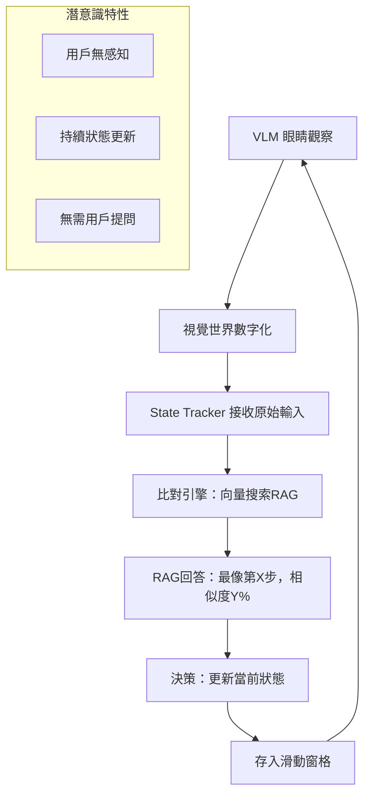
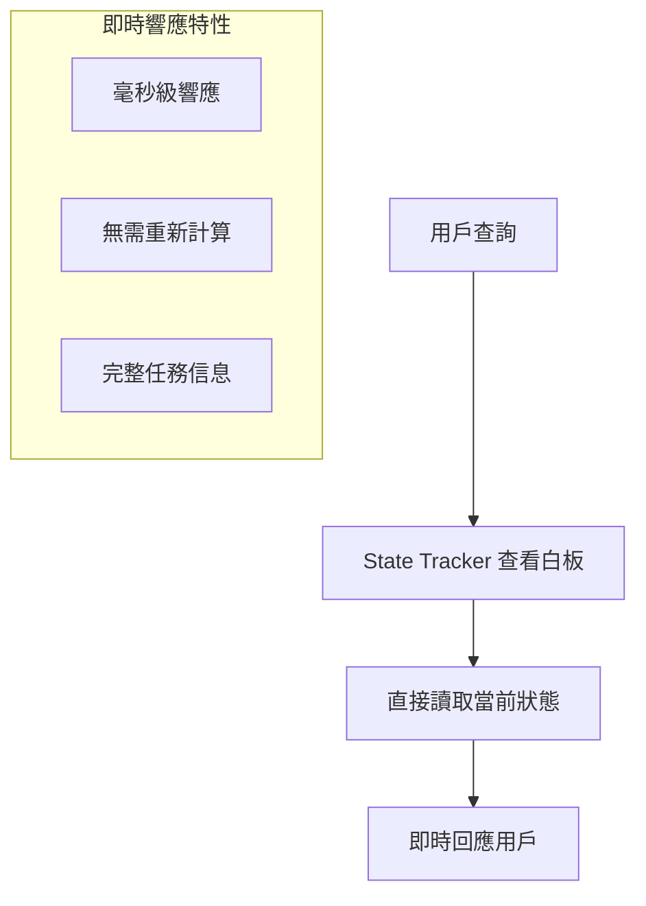
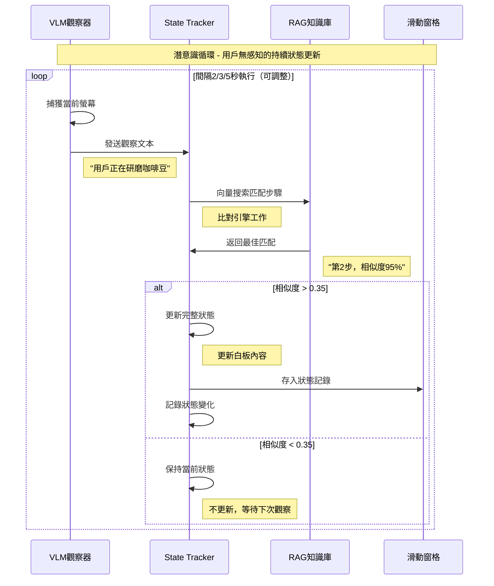
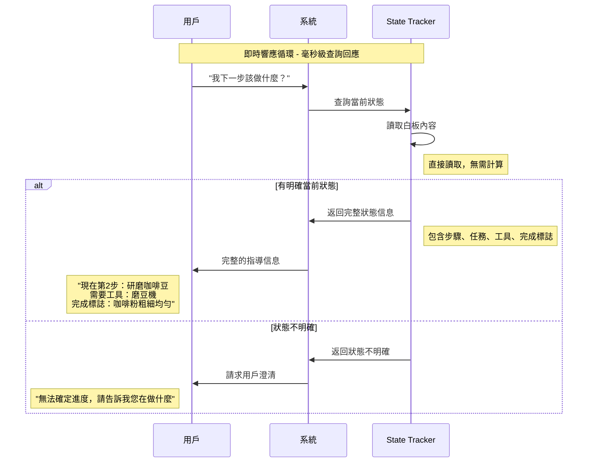
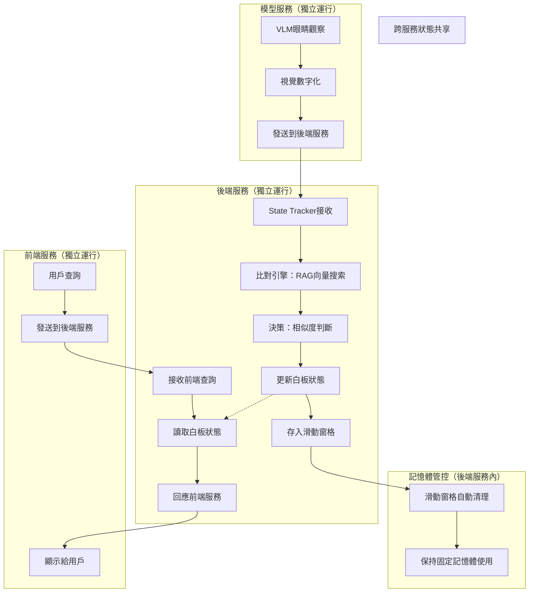

# AI Manual Assistant 記憶系統設計文檔

## 概述

AI Manual Assistant 記憶系統採用分離式服務架構的雙循環設計，實現智能任務進度追蹤：

1. **「潛意識」循環**：模型服務VLM持續觀察 → 後端服務State Tracker比對引擎 → RAG知識匹配 → 狀態更新
2. **「即時響應」循環**：前端服務用戶查詢 → 後端服務State Tracker直接回應（無需重新計算）

該系統基於分離式服務架構設計，包含三個獨立服務：模型服務（VLM觀察）、後端服務（State Tracker + RAG）、前端服務（用戶界面），通過服務間通信實現雙循環協同工作。

## 核心架構：雙循環設計

### 第一循環：潛意識狀態感知（持續運行）


### 第二循環：即時查詢響應（按需觸發）


## 核心組件設計

### 1. VLM 觀察器 (`src/memory/vlm/`) - 系統的「眼睛」

**職責**：像眼睛一樣持續觀察，將視覺世界數字化為可處理信息

**特性**：
- 無狀態設計：只負責當下觀察，不存儲歷史
- 持續運行：間隔2/3/5秒捕獲螢幕內容（通過前端index.html調整）
- 容錯設計：接受任意格式的VLM輸出，處理異常和失敗情況
- 輸出清理：標準化處理亂碼、空輸出、異常格式

```python
class VLMObserver:
    def capture_current_screen(self) -> str:
        """持續觀察當前螢幕，返回清理後的文字描述"""
        raw_output = self.vlm_api_call()
        return self.clean_and_validate_output(raw_output)
    
    def clean_and_validate_output(self, raw_output: str) -> str:
        """清理和驗證VLM輸出，處理異常格式"""
        if not raw_output or len(raw_output.strip()) == 0:
            return None  # 空輸出，將被跳過
        
        # 清理亂碼和異常字符
        cleaned = self.remove_invalid_chars(raw_output)
        return cleaned if len(cleaned) > 5 else None
    
    def handle_vlm_failure(self, error: Exception) -> None:
        """處理VLM API失敗，記錄錯誤但不中斷系統"""
        self.logger.warning(f"VLM觀察失敗: {error}")
        # 系統繼續運行，等待下次觀察
```

### 2. RAG 長期記憶 (`src/memory/rag/`) - 知識寶典

**職責**：存儲結構化的任務知識，提供高速向量搜索

**豐富的數據結構**：
```yaml
# 完整的任務知識格式
- step_id: 2
  task_description: "研磨咖啡豆至適當粗細度"
  tools_needed: ["磨豆機", "咖啡豆"]
  completion_indicators: ["咖啡粉粗細均勻", "研磨聲停止", "粉末質地適中"]
  visual_cues: ["磨豆機", "研磨", "咖啡粉", "粗細度"]
  estimated_duration: "1-2分鐘"
  safety_notes: ["注意磨豆機刀片", "避免過度研磨"]
  embedding: [0.1, 0.2, 0.3, ...]  # 預計算的768維向量
```

**關鍵方法**：
```python
class RAGKnowledgeBase:
    def find_matching_step(self, observation: str) -> MatchResult:
        """核心方法：根據VLM觀察找到最匹配的任務步驟"""
        obs_embedding = self.compute_embedding(observation)
        best_match = self.vector_search(obs_embedding)
        return MatchResult(
            step_id=best_match.step_id,
            task_description=best_match.task_description,
            tools_needed=best_match.tools_needed,
            completion_indicators=best_match.completion_indicators,
            similarity=best_match.similarity
        )
    
    def get_complete_step_info(self, step_id: int) -> StepInfo:
        """獲取步驟的完整信息"""
        pass
```

### 3. State Tracker 短期記憶 (`src/memory/state_tracker/`) - 比對引擎 + 白板

**職責**：系統的核心智能，扮演比對引擎和狀態白板的雙重角色

**完整的狀態結構**：
```python
class EnhancedStateTracker:
    def __init__(self):
        # 當前完整狀態（白板內容）
        self.current_step: Optional[int] = None
        self.current_task_description: str = ""
        self.current_tools_needed: List[str] = []
        self.current_completion_indicators: List[str] = []
        self.current_confidence: float = 0.0
        
        # 上一步信息（用於回退）
        self.previous_step: Optional[int] = None
        self.previous_task_description: str = ""
        
        # 滑動窗格（記憶體管控）
        self.sliding_window = SlidingWindow(max_size=5)
        
        # VLM容錯配置
        self.similarity_thresholds = {
            "high": 0.7,    # 高信心度閾值
            "medium": 0.5,  # 中信心度閾值  
            "low": 0.35     # 低信心度閾值
        }
        self.consecutive_failures = 0
        self.max_consecutive_failures = 10
        self.task_name: str = "煮一杯咖啡"
```

**核心方法**：
```python
def process_vlm_observation(self, vlm_text: str, rag: RAGKnowledgeBase):
    """潛意識循環：處理VLM觀察並更新狀態（含容錯處理）"""
    # 0. VLM輸出驗證
    if not vlm_text or len(vlm_text.strip()) < 5:
        self.consecutive_failures += 1
        self.logger.warning("VLM輸出無效，跳過此次觀察")
        return
    
    # 1. 比對引擎工作
    match_result = rag.find_matching_step(vlm_text)
    
    # 2. 多層相似度判斷
    if match_result.similarity > self.similarity_thresholds["high"]:
        confidence_level = "high"
        should_update = True
    elif match_result.similarity > self.similarity_thresholds["medium"]:
        confidence_level = "medium"
        should_update = True
    elif match_result.similarity > self.similarity_thresholds["low"]:
        confidence_level = "low"
        should_update = self.consecutive_failures < 3  # 保守更新
    else:
        confidence_level = "none"
        should_update = False
        self.consecutive_failures += 1
    
    # 3. 狀態更新決策
    if should_update:
        self.consecutive_failures = 0  # 重置失敗計數
        self.previous_step = self.current_step
        self.previous_task_description = self.current_task_description
        
        # 更新完整狀態信息
        self.current_step = match_result.step_id
        self.current_task_description = match_result.task_description
        self.current_tools_needed = match_result.tools_needed
        self.current_completion_indicators = match_result.completion_indicators
        self.current_confidence = match_result.similarity
        
        # 4. 存入滑動窗格（只存成功匹配的結果）
        self.sliding_window.add({
            "step": self.current_step,
            "task": self.current_task_description,
            "tools": self.current_tools_needed,
            "completion_signs": self.current_completion_indicators,
            "confidence": match_result.similarity,
            "confidence_level": confidence_level,
            "timestamp": datetime.now()
        })
    
    # 5. 連續失敗處理
    if self.consecutive_failures > self.max_consecutive_failures:
        self.handle_long_term_vlm_failure()

def handle_user_query(self, query: str) -> str:
    """即時響應循環：直接從白板讀取狀態"""
    if "下一步" in query:
        if self.current_step:
            return f"""
            現在：第{self.current_step}步 - {self.current_task_description}
            需要工具：{', '.join(self.current_tools_needed)}
            完成標誌：{', '.join(self.current_completion_indicators)}
            信心度：{self.current_confidence:.2f}
            
            下一步：第{self.current_step + 1}步
            """
        else:
            return "無法確定當前進度，VLM觀察可能不穩定，請告訴我您在做什麼任務"

def handle_long_term_vlm_failure(self):
    """處理VLM長期失效的情況"""
    self.logger.error("VLM連續失敗超過閾值，進入維持狀態模式")
    # 維持最後已知狀態，等待VLM恢復
    # 可以基於滑動窗格的歷史模式進行推斷
```

### 4. 滑動窗格 (`src/memory/sliding_window/`) - 記憶體管控器

**職責**：管控State Tracker的記憶體使用，只保留最近的狀態記錄

```python
class SlidingWindow:
    def __init__(self, max_size: int = 5):
        self.state_records = []
        self.max_size = max_size
    
    def add(self, state_record: Dict):
        """添加新的狀態記錄，自動清理舊記錄"""
        self.state_records.append(state_record)
        
        if len(self.state_records) > self.max_size:
            removed = self.state_records.pop(0)
            print(f"清理舊狀態: Step {removed['step']}")
    
    def get_recent_pattern(self, count: int = 3) -> List[Dict]:
        """獲取最近的狀態模式（用於容錯）"""
        return self.state_records[-count:]
```

## 詳細數據模型

### RAG 知識寶典模型
```python
class TaskStepKnowledge:
    step_id: int                          # 步驟編號
    task_description: str                 # 完整任務描述
    tools_needed: List[str]               # 所需工具列表
    completion_indicators: List[str]      # 完成指標
    visual_cues: List[str]                # 視覺線索關鍵詞
    estimated_duration: str               # 預估時間
    safety_notes: List[str]               # 安全注意事項
    embedding: np.ndarray                 # 預計算的語義向量
    
class MatchResult:
    step_id: int                          # 匹配的步驟ID
    task_description: str                 # 任務描述
    tools_needed: List[str]               # 所需工具
    completion_indicators: List[str]      # 完成指標
    similarity: float                     # 相似度分數 (0-1)
    matched_cues: List[str]               # 匹配到的視覺線索
```

### State Tracker 狀態模型
```python
class CompleteState:
    # 當前狀態（白板內容）
    current_step: Optional[int]           # 當前步驟ID
    current_task_description: str         # 當前任務描述
    current_tools_needed: List[str]       # 當前所需工具
    current_completion_indicators: List[str] # 當前完成指標
    current_confidence: float             # 當前狀態信心度
    
    # 歷史狀態（用於回退）
    previous_step: Optional[int]          # 上一步驟ID
    previous_task_description: str        # 上一步任務描述
    
    # 元數據
    task_name: str                        # 任務名稱
    last_update: datetime                 # 最後更新時間
    session_id: str                       # 會話ID

class StateRecord:
    """滑動窗格中的狀態記錄"""
    step: int                             # 步驟編號
    task: str                             # 任務描述
    tools: List[str]                      # 工具列表
    completion_signs: List[str]           # 完成標誌
    confidence: float                     # 信心度
    timestamp: datetime                   # 記錄時間
    
class VLMObservation:
    text: str                             # VLM觀察文本
    timestamp: datetime                   # 觀察時間
    is_valid: bool                        # 觀察是否有效
```

### 系統配置模型
```python
class SystemConfig:
    # 核心參數
    similarity_threshold: float = 0.35    # 相似度匹配閾值
    sliding_window_size: int = 5          # 滑動窗格大小
    vlm_observation_interval: int = 2     # VLM觀察間隔(秒，2/3/5可調)
    
    # 性能參數
    embedding_dimension: int = 768        # 語義向量維度
    max_response_time_ms: int = 200       # 最大響應時間
    memory_limit_mb: int = 50             # 記憶體限制
    
    # 任務參數
    default_task: str = "煮一杯咖啡"       # 預設任務
    max_steps_per_task: int = 10          # 每個任務最大步驟數

class PerformanceMetrics:
    avg_response_time_ms: float           # 平均響應時間
    state_update_frequency: float         # 狀態更新頻率
    match_accuracy_rate: float            # 匹配準確率
    memory_usage_mb: float                # 記憶體使用量
    vlm_observation_success_rate: float   # VLM觀察成功率
```

## 完整工作流程

### 第一循環：潛意識狀態感知（持續運行）



### 第二循環：即時查詢響應（按需觸發）



### 分離式服務架構流程



### 容錯機制

#### 1. VLM觀察異常處理
```python
def handle_vlm_observation_error(error_type: str):
    """處理VLM觀察過程中的異常"""
    if error_type == "CAPTURE_FAILED":
        # 跳過此次觀察，等待下次
        logger.warning("VLM捕獲失敗，跳過此次觀察")
        return None
    
    elif error_type == "INVALID_OUTPUT":
        # VLM輸出無效，使用上次有效觀察
        last_valid = state_tracker.get_last_valid_observation()
        logger.warning(f"VLM輸出無效，使用上次觀察: {last_valid}")
        return last_valid
    
    elif error_type == "TIMEOUT":
        # API超時，維持當前狀態
        logger.warning("VLM API超時，維持當前狀態")
        return state_tracker.maintain_current_state()
```

#### 2. 相似度匹配失敗處理
```python
def handle_low_similarity_match(observation: str, best_similarity: float):
    """處理相似度過低的匹配結果"""
    if best_similarity < 0.15:
        # 相似度極低，可能是新場景
        logger.info("發現可能的新場景，請求用戶確認")
        return request_user_scene_confirmation(observation)
    
    elif best_similarity < 0.35:
        # 相似度低但可能有效，檢查滑動窗格模式
        recent_pattern = sliding_window.get_recent_pattern(3)
        if is_pattern_consistent(recent_pattern):
            return infer_from_pattern(recent_pattern)
        else:
            return maintain_current_state()
```

#### 3. 狀態一致性檢查
```python
def validate_state_consistency():
    """驗證狀態更新的一致性"""
    recent_states = sliding_window.get_recent_pattern(5)
    
    # 檢查是否有異常的狀態跳躍
    for i in range(1, len(recent_states)):
        step_diff = abs(recent_states[i]['step'] - recent_states[i-1]['step'])
        if step_diff > 2:  # 步驟跳躍超過2步
            logger.warning(f"檢測到異常狀態跳躍: {recent_states[i-1]['step']} -> {recent_states[i]['step']}")
            return request_user_verification()
    
    return True
```

## 性能優化策略

### 1. 記憶體優化：滑動窗格管理

#### 最小記憶體占用策略
```python
class OptimizedStateRecord:
    """滑動窗格中的優化狀態記錄"""
    step: int                    # 4 bytes
    task_hash: str              # 32 bytes (MD5 hash)
    confidence: float           # 8 bytes
    timestamp: int              # 8 bytes (Unix timestamp)
    # 總計：約52 bytes per record
    
# 滑動窗格記憶體使用計算
WINDOW_SIZE = 5
MEMORY_PER_RECORD = 52  # bytes
TOTAL_MEMORY = WINDOW_SIZE * MEMORY_PER_RECORD  # 260 bytes
```

#### 自動記憶體清理
```python
def automatic_memory_cleanup():
    """滑動窗格的自動記憶體管理"""
    current_memory = get_sliding_window_memory_usage()
    
    if current_memory > MEMORY_THRESHOLD:
        # 清理最舊的記錄
        removed_count = sliding_window.cleanup_oldest(2)
        logger.info(f"自動清理了 {removed_count} 條舊記錄")
    
    # 記憶體使用統計
    return {
        "current_usage": current_memory,
        "max_usage": MEMORY_THRESHOLD,
        "utilization": current_memory / MEMORY_THRESHOLD
    }
```

### 2. 響應速度優化：白板機制

#### 毫秒級狀態查詢
```python
class InstantResponseStateTracker:
    def __init__(self):
        # 預格式化的回應模板（避免運行時字符串拼接）
        self.response_templates = {
            "current_status": "現在第{step}步：{task}",
            "next_step": "下一步是第{next_step}步",
            "tools_needed": "需要工具：{tools}",
            "completion_signs": "完成標誌：{signs}"
        }
        
        # 預計算的回應內容
        self.cached_responses = {}
    
    def get_instant_response(self, query_type: str) -> str:
        """O(1)時間複雜度的即時回應"""
        if query_type in self.cached_responses:
            return self.cached_responses[query_type]
        
        # 如果沒有緩存，快速生成
        return self.generate_quick_response(query_type)
    
    def update_cached_responses(self):
        """狀態更新時同步更新緩存回應"""
        self.cached_responses = {
            "current_status": self.response_templates["current_status"].format(
                step=self.current_step,
                task=self.current_task_description
            ),
            "next_step": self.response_templates["next_step"].format(
                next_step=self.current_step + 1 if self.current_step else "未知"
            )
        }
```

#### RAG預計算優化
```python
def precompute_all_embeddings():
    """系統啟動時預計算所有向量，避免運行時計算"""
    logger.info("開始預計算RAG知識庫向量...")
    
    for task_name, steps in rag_knowledge.items():
        for step in steps:
            # 組合所有文本信息
            combined_text = f"{step['task_description']} {' '.join(step['visual_cues'])}"
            
            # 預計算並存儲向量
            step['embedding'] = embedding_model.encode(combined_text)
            
    logger.info("RAG向量預計算完成")
```

### 3. 系統性能監控

#### 實時性能指標
```python
class PerformanceMonitor:
    def __init__(self):
        self.metrics = {
            "vlm_observation_time": [],
            "rag_matching_time": [],
            "state_update_time": [],
            "user_response_time": [],
            "memory_usage": []
        }
    
    def record_operation_time(self, operation: str, duration_ms: float):
        """記錄操作耗時"""
        self.metrics[f"{operation}_time"].append(duration_ms)
        
        # 保持最近100次記錄
        if len(self.metrics[f"{operation}_time"]) > 100:
            self.metrics[f"{operation}_time"].pop(0)
    
    def get_performance_summary(self) -> Dict:
        """獲取性能摘要"""
        return {
            "avg_vlm_time": np.mean(self.metrics["vlm_observation_time"]),
            "avg_rag_time": np.mean(self.metrics["rag_matching_time"]),
            "avg_response_time": np.mean(self.metrics["user_response_time"]),
            "current_memory_mb": self.get_current_memory_usage(),
            "system_health": self.calculate_system_health()
        }
```

## 測試策略

### 1. 靜態圖片測試（Demo前驗證）

#### 測試目的
在正式Demo前使用靜態圖片驗證系統準確性和穩定性

#### 測試設計
```python
class StaticImageTester:
    def __init__(self, test_images_folder: str):
        self.test_images = self.load_test_images(test_images_folder)
        self.expected_results = self.load_expected_results()
    
    def run_coffee_brewing_test(self):
        """運行煮咖啡流程的靜態圖片測試"""
        results = []
        for i, image_path in enumerate(self.test_images):
            # 1. 載入測試圖片
            image_data = self.load_image(image_path)
            
            # 2. VLM分析圖片
            vlm_observation = self.vlm_observer.analyze_image(image_data)
            
            # 3. 系統狀態識別
            predicted_step = self.state_tracker.process_vlm_observation(vlm_observation)
            
            # 4. 與預期結果比對
            expected_step = self.expected_results[i]
            accuracy = self.calculate_accuracy(predicted_step, expected_step)
            
            results.append({
                "image": image_path,
                "predicted": predicted_step,
                "expected": expected_step,
                "accuracy": accuracy
            })
        
        return self.generate_test_report(results)
```

#### 測試圖片集設計
```yaml
# 煮一杯咖啡測試圖片集
test_images:
  - image_01.jpg: 
      expected_step: 1
      description: "準備咖啡豆和器具"
      visual_cues: ["咖啡豆", "磨豆機", "濾紙"]
  
  - image_02.jpg:
      expected_step: 2  
      description: "研磨咖啡豆"
      visual_cues: ["磨豆機運作", "咖啡粉"]
  
  - image_03.jpg:
      expected_step: 3
      description: "加熱水到適當溫度"
      visual_cues: ["熱水壺", "溫度計", "蒸汽"]
  
  # ... 5-10張圖片覆蓋完整流程
```

#### 驗收標準
- **整體準確率**：> 80%
- **關鍵步驟識別**：> 90%（如研磨、沖泡等關鍵步驟）
- **系統穩定性**：所有圖片都能正常處理，無崩潰
- **容錯能力**：能處理模糊或異常圖片

### 2. 雙循環功能測試

#### 潛意識循環測試
```python
def test_unconscious_loop():
    """測試潛意識狀態感知循環"""
    system = AIManualAssistant()
    
    # 模擬VLM觀察序列
    observations = [
        "用戶準備咖啡器具",
        "用戶拿出咖啡豆",
        "用戶打開磨豆機",
        "用戶開始研磨咖啡豆",
        "咖啡粉研磨完成"
    ]
    
    expected_states = [1, 1, 2, 2, 2]  # 期望的狀態變化
    
    for i, obs in enumerate(observations):
        system.state_tracker.process_vlm_observation(obs, system.rag)
        current_step = system.state_tracker.current_step
        
        assert current_step == expected_states[i], f"步驟 {i}: 期望 {expected_states[i]}, 實際 {current_step}"
    
    # 驗證滑動窗格記錄
    window_records = system.state_tracker.sliding_window.state_records
    assert len(window_records) <= 5, "滑動窗格大小應該 <= 5"
```

#### 即時響應循環測試
```python
def test_instant_response_loop():
    """測試即時查詢響應循環"""
    system = AIManualAssistant()
    
    # 設置已知狀態
    system.state_tracker.current_step = 2
    system.state_tracker.current_task_description = "研磨咖啡豆"
    system.state_tracker.current_tools_needed = ["磨豆機"]
    
    # 測試各種查詢
    test_queries = [
        ("我下一步該做什麼？", "第3步"),
        ("現在在哪個步驟？", "第2步"),
        ("需要什麼工具？", "磨豆機")
    ]
    
    for query, expected_content in test_queries:
        start_time = time.time()
        response = system.handle_user_input(query)
        response_time = (time.time() - start_time) * 1000  # 轉換為毫秒
        
        assert expected_content in response, f"回應中應包含 '{expected_content}'"
        assert response_time < 50, f"響應時間應 < 50ms, 實際 {response_time}ms"
```

### 2. 記憶體管理測試
```python
def test_memory_management():
    """測試滑動窗格記憶體管理"""
    sliding_window = SlidingWindow(max_size=3)
    
    # 添加超過容量的記錄
    for i in range(10):
        sliding_window.add({
            "step": i,
            "task": f"任務 {i}",
            "confidence": 0.8,
            "timestamp": datetime.now()
        })
    
    # 驗證窗格大小限制
    assert len(sliding_window.state_records) == 3, "滑動窗格應該只保留3條記錄"
    
    # 驗證保留的是最新記錄
    latest_steps = [record["step"] for record in sliding_window.state_records]
    assert latest_steps == [7, 8, 9], "應該保留最新的3條記錄"
```

### 3. 端到端集成測試
```python
def test_end_to_end_workflow():
    """測試完整的端到端工作流程"""
    system = AIManualAssistant()
    
    # 模擬完整的用戶場景
    scenario = [
        ("VLM觀察", "用戶正在準備咖啡器具"),
        ("用戶查詢", "我現在該做什麼？"),
        ("VLM觀察", "用戶拿出咖啡豆和磨豆機"),
        ("用戶查詢", "下一步是什麼？"),
        ("VLM觀察", "用戶開始研磨咖啡豆"),
        ("用戶查詢", "我做對了嗎？")
    ]
    
    responses = []
    for action_type, content in scenario:
        if action_type == "VLM觀察":
            system.state_tracker.process_vlm_observation(content, system.rag)
        elif action_type == "用戶查詢":
            response = system.handle_user_input(content)
            responses.append(response)
    
    # 驗證系統能夠提供有意義的回應
    for response in responses:
        assert len(response) > 10, "回應應該包含有意義的內容"
        assert "步" in response, "回應應該包含步驟信息"
```

## 實施策略

### 階段1：RAG 知識寶典建設
**目標**：建立結構化的任務知識寶典，支持高速向量搜索

**核心任務**：
- 設計豐富的任務步驟數據格式（包含工具、完成指標等）
- 實現RAG向量搜索引擎
- 預計算所有任務步驟的語義embeddings
- 創建任務知識的管理接口

**交付物**：
- `src/memory/rag/knowledge_base.py` - 知識庫核心
- `src/memory/rag/vector_search.py` - 向量搜索引擎
- `data/tasks/coffee_brewing.yaml` - 示例任務數據
- RAG功能單元測試

**驗收標準**：
- 向量搜索響應時間 < 10ms
- 支持至少10個任務，每個任務10個步驟
- 匹配準確率 > 80%

### 階段2：State Tracker 比對引擎
**目標**：實現State Tracker的核心比對引擎和白板機制

**核心任務**：
- 實現VLM觀察處理邏輯
- 建立與RAG的向量匹配機制
- 實現滑動窗格記憶體管理
- 創建狀態更新和查詢機制

**交付物**：
- `src/memory/state_tracker/tracker.py` - 核心追蹤器
- `src/memory/state_tracker/sliding_window.py` - 滑動窗格
- `src/memory/vlm/observer.py` - VLM觀察器
- 狀態追蹤功能測試

**驗收標準**：
- 狀態更新響應時間 < 50ms
- 用戶查詢響應時間 < 20ms
- 滑動窗格記憶體使用 < 1MB

### 階段3：雙循環系統整合
**目標**：整合潛意識循環和即時響應循環，形成完整系統

**核心任務**：
- 實現潛意識循環的持續運行機制
- 建立即時響應循環的查詢處理
- 整合VLM、State Tracker、RAG三大組件
- 實現系統協調和錯誤處理

**交付物**：
- `src/memory/system/coordinator.py` - 系統協調器
- `src/memory/system/loops.py` - 雙循環實現
- `src/memory/config/settings.py` - 系統配置
- 完整工作流程測試

**驗收標準**：
- 潛意識循環穩定運行 > 1小時
- 即時響應成功率 > 95%
- 系統整體記憶體使用 < 50MB

### 階段4：性能優化和監控
**目標**：優化系統性能，實現生產級別的穩定性

**核心任務**：
- 實現記憶體自動管理和清理
- 添加性能監控和指標收集
- 優化向量計算和緩存機制
- 實現系統健康檢查

**交付物**：
- `src/memory/performance/monitor.py` - 性能監控
- `src/memory/performance/optimizer.py` - 性能優化器
- `src/memory/utils/memory_manager.py` - 記憶體管理
- 性能基準測試套件

**驗收標準**：
- 系統可持續運行 > 24小時
- 記憶體使用穩定，無洩漏
- 所有操作響應時間達標

### 階段5：Demo整合和展示
**目標**：整合到論文Demo中，展示核心功能

**核心任務**：
- 創建Demo場景和腳本
- 實現用戶交互界面
- 添加系統狀態可視化
- 準備Demo演示材料

**交付物**：
- `demo/memory_system_demo.py` - Demo主程序
- `demo/scenarios/` - Demo場景腳本
- `demo/ui/` - 簡單的可視化界面
- Demo演示文檔和視頻

**驗收標準**：
- Demo能穩定運行完整場景
- 展示雙循環工作機制
- 體現記憶體管控效果

## 關鍵技術參數

### 系統配置參數
```python
# 核心參數
SIMILARITY_THRESHOLD = 0.35          # 相似度匹配閾值
SLIDING_WINDOW_SIZE = 5              # 滑動窗格大小
VLM_OBSERVATION_INTERVAL = 2         # VLM觀察間隔(秒，2/3/5可調)
EMBEDDING_DIMENSION = 768            # 語義向量維度

# 性能參數
MAX_USER_RESPONSE_TIME = 50          # 最大用戶響應時間(ms)
MAX_STATE_UPDATE_TIME = 100          # 最大狀態更新時間(ms)
MAX_MEMORY_USAGE = 50                # 最大記憶體使用(MB)
MAX_RAG_SEARCH_TIME = 10             # 最大RAG搜索時間(ms)

# 容錯參數
MIN_CONFIDENCE_THRESHOLD = 0.15      # 最小信心度閾值
MAX_VLM_ERROR_TOLERANCE = 3          # VLM錯誤容忍次數
STATE_CONSISTENCY_CHECK_INTERVAL = 10 # 狀態一致性檢查間隔(次)
```

### 預期性能指標

#### 響應性能
- **用戶查詢響應**：< 50ms (目標: 20ms)
- **狀態更新延遲**：< 100ms (目標: 50ms)
- **RAG向量搜索**：< 10ms (目標: 5ms)
- **VLM觀察處理**：< 200ms (目標: 100ms)

#### 準確性指標
- **狀態匹配準確率**：> 85% (目標: 90%)
- **用戶查詢滿意度**：> 90% (目標: 95%)
- **系統穩定運行時間**：> 24小時 (目標: 72小時)

#### 資源使用
- **記憶體使用**：< 50MB (目標: 30MB)
- **CPU使用率**：< 20% (目標: 10%)
- **存儲空間**：< 20MB (目標: 10MB)

#### Demo展示指標
- **場景完成率**：100%
- **Demo運行穩定性**：> 99%
- **功能展示完整性**：涵蓋雙循環、記憶體管控、即時響應

這個實施策略確保了系統能夠在論文Demo中有效展示核心創新點，同時保持工程實用性和技術先進性。