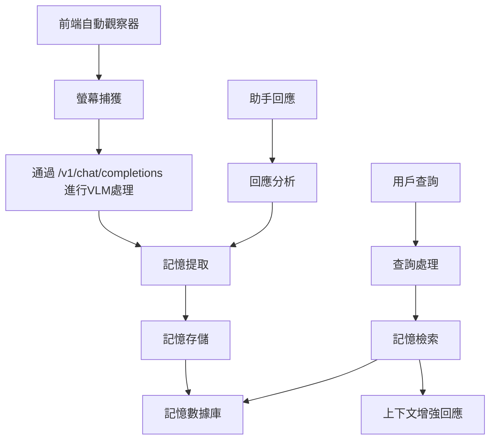

# 設計文檔

## 概述

AI Manual Assistant 記憶系統實現雙軌架構，包括：
1. **持續觀察軌道**：基於VLM的螢幕觀察和處理
2. **記憶存儲軌道**：上下文信息存儲和檢索

該系統利用現有的前端自動觀察功能和後端VLM處理，在提供強大記憶功能的同時最小化開發複雜性。

## 架構



## 組件和接口

### 1. 記憶存儲組件 (`src/memory/storage.py`)

**目的**：處理上下文記憶的持久存儲和檢索

**關鍵方法**：
- `store_memory(content, context_type, timestamp, metadata)` - 存儲記憶
- `retrieve_memories(query, limit, time_range)` - 檢索記憶
- `search_memories(keywords, similarity_threshold)` - 搜索記憶
- `cleanup_old_memories(retention_policy)` - 清理舊記憶

**存儲格式**：
```python
{
    "id": "unique_memory_id",
    "content": "extracted_contextual_information",
    "context_type": "screen_observation|user_interaction|system_event",
    "timestamp": "2024-01-01T12:00:00Z",
    "metadata": {
        "source": "screen_capture|chat|system",
        "relevance_score": 0.85,
        "tags": ["coding", "python", "debugging"]
    }
}
```

### 2. 記憶處理組件 (`src/memory/processor.py`)

**目的**：從觀察和互動中提取有意義的上下文

**關鍵方法**：
- `process_observation(screen_data, vlm_response)` - 處理觀察
- `extract_context(raw_content)` - 提取上下文
- `determine_relevance(content, current_context)` - 確定相關性
- `generate_memory_tags(content)` - 生成記憶標籤

### 3. 記憶整合組件 (`src/memory/integration.py`)

**目的**：將記憶功能與現有後端系統整合

**關鍵方法**：
- `enhance_chat_response(user_query, relevant_memories)` - 增強聊天回應
- `process_vlm_observation(observation_data)` - 處理VLM觀察
- `update_memory_from_interaction(user_input, assistant_response)` - 從互動更新記憶

### 4. 前端記憶接口 (`src/frontend/js/memory.js`)

**目的**：處理記憶相關的前端功能

**關鍵方法**：
- `initializeMemorySystem()` - 初始化記憶系統
- `processAutoObservation(capturedData)` - 處理自動觀察
- `displayMemoryStatus()` - 顯示記憶狀態
- `handleMemoryControls()` - 處理記憶控制

## 數據模型

### 記憶記錄
```python
class MemoryRecord:
    id: str                    # 記憶ID
    content: str              # 記憶內容
    context_type: MemoryType  # 上下文類型
    timestamp: datetime       # 時間戳
    metadata: Dict[str, Any]  # 元數據
    relevance_score: float    # 相關性分數
    tags: List[str]          # 標籤列表
```

### 記憶查詢
```python
class MemoryQuery:
    query_text: str                                    # 查詢文本
    time_range: Optional[Tuple[datetime, datetime]]    # 時間範圍
    context_types: List[MemoryType]                    # 上下文類型
    limit: int = 10                                    # 結果限制
    min_relevance: float = 0.5                         # 最小相關性
```

### 記憶上下文
```python
class MemoryContext:
    current_activity: str        # 當前活動
    recent_interactions: List[str]  # 最近互動
    active_applications: List[str]  # 活動應用程序
    user_focus_area: str           # 用戶關注區域
```

## 錯誤處理

### 1. 存儲錯誤
- **數據庫連接問題**：實現指數退避的重試邏輯
- **存儲容量**：基於年齡和相關性實現自動清理
- **數據損壞**：維護備份副本和驗證校驗和

### 2. 處理錯誤
- **VLM API 失敗**：將觀察排隊重試，繼續使用緩存上下文
- **記憶提取失敗**：記錄錯誤，繼續操作而不存儲無效記憶
- **上下文分析錯誤**：使用後備的簡單文本提取方法

### 3. 整合錯誤
- **前端通信**：當記憶系統不可用時實現優雅降級
- **後端整合**：確保即使記憶增強失敗，聊天功能仍能繼續
- **性能問題**：實現斷路器和速率限制

## 測試策略

### 1. 單元測試
- 記憶存儲操作（CRUD）
- 上下文提取算法
- 記憶相關性評分
- 數據模型驗證

### 2. 整合測試
- 前端到後端記憶流程
- VLM觀察處理管道
- 帶記憶上下文的聊天增強
- 跨組件錯誤處理

### 3. 性能測試
- 記憶存儲和檢索速度
- 並發觀察處理
- 記憶清理效率
- 系統資源使用監控

### 4. 端到端測試
- 完整的觀察到記憶工作流程
- 記憶增強的聊天互動
- 隱私和數據處理合規性
- 故障後系統恢復

## 實施策略

### 階段1：核心記憶存儲
- 實現基本記憶存儲和檢索
- 創建數據模型和數據庫架構
- 為存儲操作構建單元測試

### 階段2：VLM整合
- 修改現有的 /v1/chat/completions 端點以支持記憶處理
- 實現觀察處理管道
- 從VLM回應中添加記憶提取

### 階段3：前端整合
- 增強現有自動觀察以供給記憶系統
- 添加記憶狀態指示器
- 實現記憶管理的用戶控制

### 階段4：聊天增強
- 將記憶檢索整合到聊天回應中
- 實現上下文感知的回應生成
- 從用戶互動中添加記憶學習

### 階段5：優化和完善
- 實現性能優化
- 添加全面的錯誤處理
- 創建用戶文檔和控制