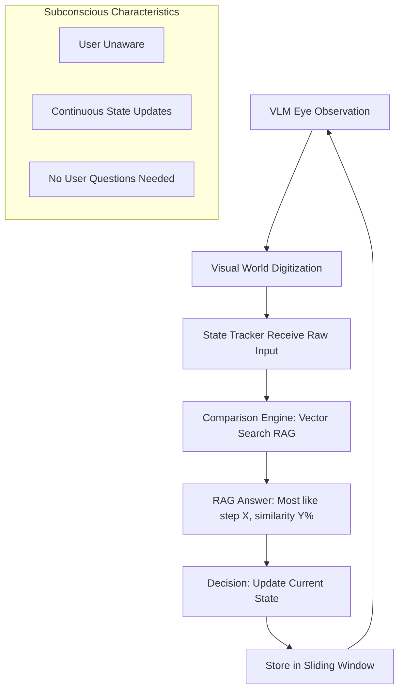
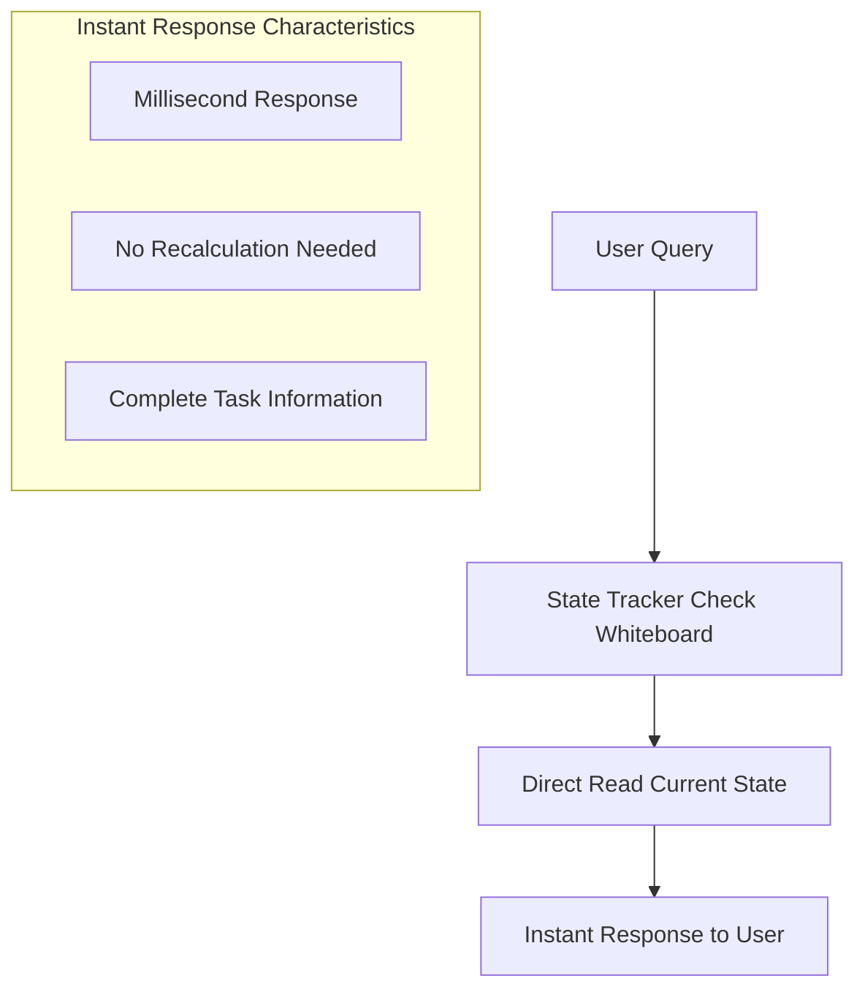
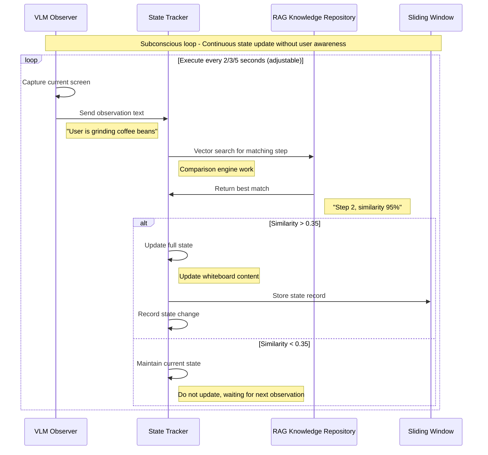
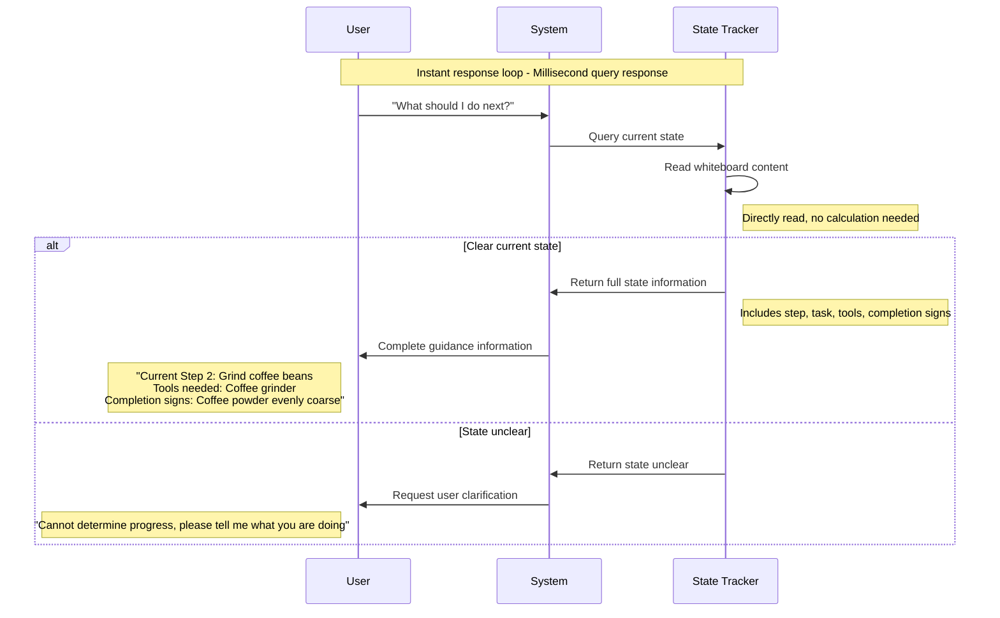
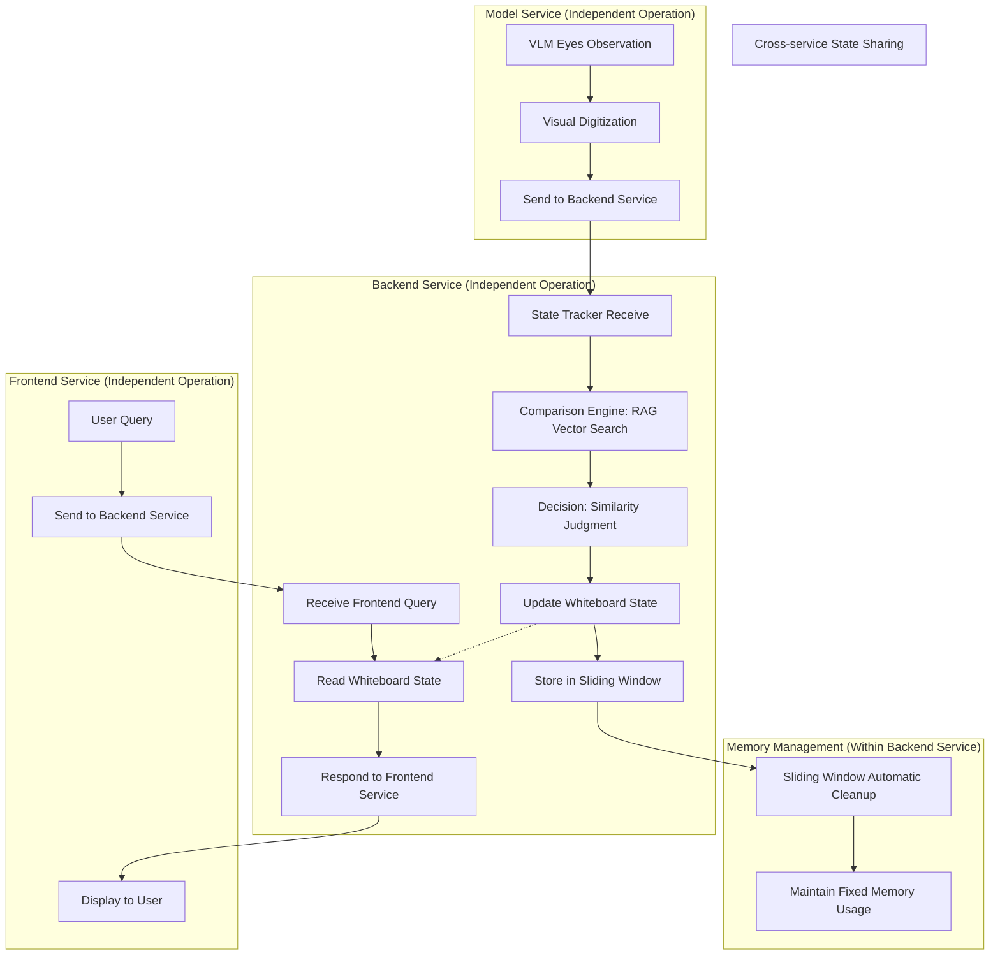

# AI Manual Assistant Memory System Design Document

## Overview

The AI Manual Assistant memory system adopts a dual-loop design with separated service architecture to achieve intelligent task progress tracking:

1. **"Subconscious" Loop**: Model service VLM continuous observation → Backend service State Tracker comparison engine → RAG knowledge matching → State update
2. **"Instant Response" Loop**: Frontend service user query → Backend service State Tracker direct response (no recalculation needed)

The system is designed based on separated service architecture, including three independent services: model service (VLM observation), backend service (State Tracker + RAG), frontend service (user interface), achieving dual-loop collaborative work through inter-service communication.

## Core Architecture: Dual-Loop Design

### First Loop: Subconscious State Perception (Continuous Operation)


### Second Loop: Instant Query Response (Triggered on Demand)


## Core Component Design

### 1. VLM Observer (`src/memory/vlm/`) - System's "Eyes"

**Responsibility**: Like eyes continuously observing, digitizing the visual world into processable information

**Characteristics**:
- Stateless design: Only responsible for current observation, no historical storage
- Continuous operation: Capture screen content every 2/3/5 seconds (adjustable through frontend index.html)
- Fault-tolerant design: Accept arbitrary VLM output formats, handle exceptions and failure situations
- Output cleaning: Standardize processing of garbled text, empty output, abnormal formats

```python
class VLMObserver:
    def capture_current_screen(self) -> str:
        """Continuously observe current screen, return cleaned text description"""
        raw_output = self.vlm_api_call()
        return self.clean_and_validate_output(raw_output)
    
    def clean_and_validate_output(self, raw_output: str) -> str:
        """Clean and validate VLM output, handle abnormal formats"""
        if not raw_output or len(raw_output.strip()) == 0:
            return None  # Empty output, will be skipped
        
        # Clean garbled text and abnormal characters
        cleaned = self.remove_invalid_chars(raw_output)
        return cleaned if len(cleaned) > 5 else None
    
    def handle_vlm_failure(self, error: Exception) -> None:
        """Handle VLM API failure, log error but don't interrupt system"""
        self.logger.warning(f"VLM observation failed: {error}")
        # System continues running, waiting for next observation
```

### 2. RAG Long-term Memory (`src/memory/rag/`) - Knowledge Repository

**Responsibility**: Store structured task knowledge, provide high-speed vector search

**Rich Data Structure**:
```yaml
# Complete task knowledge format
- step_id: 2
  task_description: "Grind coffee beans to appropriate coarseness"
  tools_needed: ["coffee grinder", "coffee beans"]
  completion_indicators: ["coffee powder evenly coarse", "grinding sound stops", "powder texture moderate"]
  visual_cues: ["coffee grinder", "grinding", "coffee powder", "coarseness"]
  estimated_duration: "1-2 minutes"
  safety_notes: ["Watch grinder blades", "Avoid over-grinding"]
  embedding: [0.1, 0.2, 0.3, ...]  # Pre-computed 768-dimensional vector
```

**Key Methods**:
```python
class RAGKnowledgeBase:
    def find_matching_step(self, observation: str) -> MatchResult:
        """Core method: find the most matching task step based on VLM observation"""
        obs_embedding = self.compute_embedding(observation)
        best_match = self.vector_search(obs_embedding)
        return MatchResult(
            step_id=best_match.step_id,
            task_description=best_match.task_description,
            tools_needed=best_match.tools_needed,
            completion_indicators=best_match.completion_indicators,
            similarity=best_match.similarity
        )
    
    def get_complete_step_info(self, step_id: int) -> StepInfo:
        """Get complete step information"""
        pass
```

### 3. State Tracker Short-term Memory (`src/memory/state_tracker/`) - Comparison Engine + Whiteboard

**Responsibility**: System's core intelligence, playing dual roles of comparison engine and whiteboard

**Complete State Structure**:
```python
class EnhancedStateTracker:
    def __init__(self):
        # Current full state (whiteboard content)
        self.current_step: Optional[int] = None
        self.current_task_description: str = ""
        self.current_tools_needed: List[str] = []
        self.current_completion_indicators: List[str] = []
        self.current_confidence: float = 0.0
        
        # Previous step information (for backtracking)
        self.previous_step: Optional[int] = None
        self.previous_task_description: str = ""
        
        # Sliding window (memory management)
        self.sliding_window = SlidingWindow(max_size=5)
        
        # VLM fault tolerance configuration
        self.similarity_thresholds = {
            "high": 0.7,    # High confidence threshold
            "medium": 0.5,  # Medium confidence threshold  
            "low": 0.35     # Low confidence threshold
        }
        self.consecutive_failures = 0
        self.max_consecutive_failures = 10
        self.task_name: str = "Make a cup of coffee"
```

**Core Methods**:
```python
def process_vlm_observation(self, vlm_text: str, rag: RAGKnowledgeBase):
    """Subconscious loop: process VLM observation and update state (with fault tolerance)"""
    # 0. VLM output validation
    if not vlm_text or len(vlm_text.strip()) < 5:
        self.consecutive_failures += 1
        self.logger.warning("VLM output invalid, skipping this observation")
        return
    
    # 1. Comparison engine work
    match_result = rag.find_matching_step(vlm_text)
    
    # 2. Multi-level similarity judgment
    if match_result.similarity > self.similarity_thresholds["high"]:
        confidence_level = "high"
        should_update = True
    elif match_result.similarity > self.similarity_thresholds["medium"]:
        confidence_level = "medium"
        should_update = True
    elif match_result.similarity > self.similarity_thresholds["low"]:
        confidence_level = "low"
        should_update = self.consecutive_failures < 3  # Conservative update
    else:
        confidence_level = "none"
        should_update = False
        self.consecutive_failures += 1
    
    # 3. State update decision
    if should_update:
        self.consecutive_failures = 0  # Reset failure count
        self.previous_step = self.current_step
        self.previous_task_description = self.current_task_description
        
        # Update full state information
        self.current_step = match_result.step_id
        self.current_task_description = match_result.task_description
        self.current_tools_needed = match_result.tools_needed
        self.current_completion_indicators = match_result.completion_indicators
        self.current_confidence = match_result.similarity
        
        # 4. Store in sliding window (only store successful matches)
        self.sliding_window.add({
            "step": self.current_step,
            "task": self.current_task_description,
            "tools": self.current_tools_needed,
            "completion_signs": self.current_completion_indicators,
            "confidence": match_result.similarity,
            "confidence_level": confidence_level,
            "timestamp": datetime.now()
        })
    
    # 5. Continuous failure handling
    if self.consecutive_failures > self.max_consecutive_failures:
        self.handle_long_term_vlm_failure()

def handle_user_query(self, query: str) -> str:
    """Instant response loop: directly read state from whiteboard"""
    if "next step" in query:
        if self.current_step:
            return f"""
            Current: Step {self.current_step} - {self.current_task_description}
            Tools needed: {', '.join(self.current_tools_needed)}
            Completion signs: {', '.join(self.current_completion_indicators)}
            Confidence: {self.current_confidence:.2f}
            
            Next step: Step {self.current_step + 1}
            """
        else:
            return "Cannot determine current progress, VLM observation may be unstable, please tell me what you are doing"

def handle_long_term_vlm_failure(self):
    """Handle long-term VLM failure"""
    self.logger.error("VLM consecutive failures exceed threshold, entering maintenance state mode")
    # Maintain the last known state, waiting for VLM to recover
    # Can infer based on historical patterns of the sliding window
```

### 4. Sliding Window (`src/memory/sliding_window/`) - Memory Manager

**Responsibility**: Manage State Tracker's memory usage, only retain the most recent state records

```python
class SlidingWindow:
    def __init__(self, max_size: int = 5):
        self.state_records = []
        self.max_size = max_size
    
    def add(self, state_record: Dict):
        """Add new state record, automatically clean up old records"""
        self.state_records.append(state_record)
        
        if len(self.state_records) > self.max_size:
            removed = self.state_records.pop(0)
            print(f"Cleaning up old state: Step {removed['step']}")
    
    def get_recent_pattern(self, count: int = 3) -> List[Dict]:
        """Get recent state patterns (for fault tolerance)"""
        return self.state_records[-count:]
```

## Detailed Data Models

### RAG Knowledge Repository Model
```python
class TaskStepKnowledge:
    step_id: int                          # Step ID
    task_description: str                 # Full task description
    tools_needed: List[str]               # List of required tools
    completion_indicators: List[str]      # Completion indicators
    visual_cues: List[str]                # Visual线索关键词
    estimated_duration: str               # Estimated time
    safety_notes: List[str]               # Safety notes
    embedding: np.ndarray                 # Pre-computed semantic vector
    
class MatchResult:
    step_id: int                          # Matching step ID
    task_description: str                 # Task description
    tools_needed: List[str]               # Required tools
    completion_indicators: List[str]      # Completion indicators
    similarity: float                     # Similarity score (0-1)
    matched_cues: List[str]               # Visual cues matched
```

### State Tracker State Model
```python
class CompleteState:
    # Current state (whiteboard content)
    current_step: Optional[int]           # Current step ID
    current_task_description: str         # Current task description
    current_tools_needed: List[str]       # Current required tools
    current_completion_indicators: List[str] # Current completion indicators
    current_confidence: float             # Current state confidence
    
    # Historical state (for backtracking)
    previous_step: Optional[int]          # Previous step ID
    previous_task_description: str        # Previous task description
    
    # Metadata
    task_name: str                        # Task name
    last_update: datetime                 # Last update time
    session_id: str                       # Session ID

class StateRecord:
    """State record in sliding window"""
    step: int                             # Step ID
    task: str                             # Task description
    tools: List[str]                      # List of tools
    completion_signs: List[str]           # Completion signs
    confidence: float                     # Confidence
    timestamp: datetime                   # Record time
    
class VLMObservation:
    text: str                             # VLM observation text
    timestamp: datetime                   # Observation time
    is_valid: bool                        # Whether observation is valid
```

### System Configuration Model
```python
class SystemConfig:
    # Core parameters
    similarity_threshold: float = 0.35    # Similarity matching threshold
    sliding_window_size: int = 5          # Sliding window size
    vlm_observation_interval: int = 2     # VLM observation interval (seconds, 2/3/5 adjustable)
    
    # Performance parameters
    embedding_dimension: int = 768        # Semantic vector dimension
    max_response_time_ms: int = 200       # Maximum response time
    memory_limit_mb: int = 50             # Memory limit
    
    # Task parameters
    default_task: str = "Make a cup of coffee"       # Default task
    max_steps_per_task: int = 10          # Maximum steps per task

class PerformanceMetrics:
    avg_response_time_ms: float           # Average response time
    state_update_frequency: float         # State update frequency
    match_accuracy_rate: float            # Match accuracy rate
    memory_usage_mb: float                # Memory usage
    vlm_observation_success_rate: float   # VLM observation success rate
```

## Full Workflow

### First Loop: Subconscious State Perception (Continuous Operation)



### Second Loop: Instant Query Response (Triggered on Demand)



### Separated Service Architecture Flow



### Fault Tolerance Mechanisms

#### 1. VLM Observation Abnormal Handling
```python
def handle_vlm_observation_error(error_type: str):
    """Handle abnormal VLM observation"""
    if error_type == "CAPTURE_FAILED":
        # Skip this observation, wait for next
        logger.warning("VLM capture failed, skipping this observation")
        return None
    
    elif error_type == "INVALID_OUTPUT":
        # VLM output invalid, use last valid observation
        last_valid = state_tracker.get_last_valid_observation()
        logger.warning(f"VLM output invalid, using last observation: {last_valid}")
        return last_valid
    
    elif error_type == "TIMEOUT":
        # API timeout, maintain current state
        logger.warning("VLM API timeout, maintaining current state")
        return state_tracker.maintain_current_state()
```

#### 2. Low Similarity Match Handling
```python
def handle_low_similarity_match(observation: str, best_similarity: float):
    """Handle low similarity match results"""
    if best_similarity < 0.15:
        # Extremely low similarity, might be a new scenario
        logger.info("Found potentially new scenario, requesting user confirmation")
        return request_user_scene_confirmation(observation)
    
    elif best_similarity < 0.35:
        # Low similarity but potentially valid, check sliding window pattern
        recent_pattern = sliding_window.get_recent_pattern(3)
        if is_pattern_consistent(recent_pattern):
            return infer_from_pattern(recent_pattern)
        else:
            return maintain_current_state()
```

#### 3. State Consistency Check
```python
def validate_state_consistency():
    """Validate state update consistency"""
    recent_states = sliding_window.get_recent_pattern(5)
    
    # Check for abnormal state jumps
    for i in range(1, len(recent_states)):
        step_diff = abs(recent_states[i]['step'] - recent_states[i-1]['step'])
        if step_diff > 2:  # Step jump exceeds 2 steps
            logger.warning(f"Detected abnormal state jump: {recent_states[i-1]['step']} -> {recent_states[i]['step']}")
            return request_user_verification()
    
    return True
```

## Performance Optimization Strategies

### 1. Memory Optimization: Sliding Window Management

#### Minimal Memory Occupancy Strategy
```python
class OptimizedStateRecord:
    """Optimized state record in sliding window"""
    step: int                    # 4 bytes
    task_hash: str              # 32 bytes (MD5 hash)
    confidence: float           # 8 bytes
    timestamp: int              # 8 bytes (Unix timestamp)
    # Total: ~52 bytes per record
    
# Sliding window memory usage calculation
WINDOW_SIZE = 5
MEMORY_PER_RECORD = 52  # bytes
TOTAL_MEMORY = WINDOW_SIZE * MEMORY_PER_RECORD  # 260 bytes
```

#### Automatic Memory Cleanup
```python
def automatic_memory_cleanup():
    """Automatic memory management for sliding window"""
    current_memory = get_sliding_window_memory_usage()
    
    if current_memory > MEMORY_THRESHOLD:
        # Clean up the oldest records
        removed_count = sliding_window.cleanup_oldest(2)
        logger.info(f"Automatically cleaned up {removed_count} old records")
    
    # Memory usage statistics
    return {
        "current_usage": current_memory,
        "max_usage": MEMORY_THRESHOLD,
        "utilization": current_memory / MEMORY_THRESHOLD
    }
```

### 2. Response Speed Optimization: Whiteboard Mechanism

#### Millisecond State Query
```python
class InstantResponseStateTracker:
    def __init__(self):
        # Pre-formatted response templates (to avoid string concatenation at runtime)
        self.response_templates = {
            "current_status": "Current Step {step}: {task}",
            "next_step": "Next step is Step {next_step}",
            "tools_needed": "Tools needed: {tools}",
            "completion_signs": "Completion signs: {signs}"
        }
        
        # Pre-calculated response content
        self.cached_responses = {}
    
    def get_instant_response(self, query_type: str) -> str:
        """O(1) time complexity instant response"""
        if query_type in self.cached_responses:
            return self.cached_responses[query_type]
        
        # If no cache, generate quickly
        return self.generate_quick_response(query_type)
    
    def update_cached_responses(self):
        """Synchronize cached responses when state updates"""
        self.cached_responses = {
            "current_status": self.response_templates["current_status"].format(
                step=self.current_step,
                task=self.current_task_description
            ),
            "next_step": self.response_templates["next_step"].format(
                next_step=self.current_step + 1 if self.current_step else "Unknown"
            )
        }
```

#### RAG Pre-computation Optimization
```python
def precompute_all_embeddings():
    """Pre-compute all vectors at system startup to avoid runtime calculation"""
    logger.info("Starting pre-computation of RAG knowledge base vectors...")
    
    for task_name, steps in rag_knowledge.items():
        for step in steps:
            # Combine all text information
            combined_text = f"{step['task_description']} {' '.join(step['visual_cues'])}"
            
            # Pre-compute and store vector
            step['embedding'] = embedding_model.encode(combined_text)
            
    logger.info("RAG vector pre-computation complete")
```

### 3. System Performance Monitoring

#### Real-time Performance Metrics
```python
class PerformanceMonitor:
    def __init__(self):
        self.metrics = {
            "vlm_observation_time": [],
            "rag_matching_time": [],
            "state_update_time": [],
            "user_response_time": [],
            "memory_usage": []
        }
    
    def record_operation_time(self, operation: str, duration_ms: float):
        """Record operation duration"""
        self.metrics[f"{operation}_time"].append(duration_ms)
        
        # Keep the last 100 records
        if len(self.metrics[f"{operation}_time"]) > 100:
            self.metrics[f"{operation}_time"].pop(0)
    
    def get_performance_summary(self) -> Dict:
        """Get performance summary"""
        return {
            "avg_vlm_time": np.mean(self.metrics["vlm_observation_time"]),
            "avg_rag_time": np.mean(self.metrics["rag_matching_time"]),
            "avg_response_time": np.mean(self.metrics["user_response_time"]),
            "current_memory_mb": self.get_current_memory_usage(),
            "system_health": self.calculate_system_health()
        }
```

## Test Strategies

### 1. Static Image Testing (Pre-Demo Validation)

#### Test Purpose
Use static images to validate the system's accuracy and stability before the formal Demo

#### Test Design
```python
class StaticImageTester:
    def __init__(self, test_images_folder: str):
        self.test_images = self.load_test_images(test_images_folder)
        self.expected_results = self.load_expected_results()
    
    def run_coffee_brewing_test(self):
        """Run static image testing for coffee brewing process"""
        results = []
        for i, image_path in enumerate(self.test_images):
            # 1. Load test image
            image_data = self.load_image(image_path)
            
            # 2. VLM analyze image
            vlm_observation = self.vlm_observer.analyze_image(image_data)
            
            # 3. System state identification
            predicted_step = self.state_tracker.process_vlm_observation(vlm_observation)
            
            # 4. Compare with expected results
            expected_step = self.expected_results[i]
            accuracy = self.calculate_accuracy(predicted_step, expected_step)
            
            results.append({
                "image": image_path,
                "predicted": predicted_step,
                "expected": expected_step,
                "accuracy": accuracy
            })
        
        return self.generate_test_report(results)
```

#### Test Image Set Design
```yaml
# Coffee brewing test image set
test_images:
  - image_01.jpg: 
      expected_step: 1
      description: "Prepare coffee beans and utensils"
      visual_cues: ["coffee beans", "coffee grinder", "filter paper"]
  
  - image_02.jpg:
      expected_step: 2  
      description: "Grind coffee beans"
      visual_cues: ["coffee grinder operating", "coffee powder"]
  
  - image_03.jpg:
      expected_step: 3
      description: "Heat water to appropriate temperature"
      visual_cues: ["kettle", "thermometer", "steam"]
  
  # ... 5-10 images covering the full process
```

#### Acceptance Criteria
- **Overall Accuracy**: > 80%
- **Key Step Identification**: > 90% (e.g., grinding, brewing)
- **System Stability**: All images can be processed without crashing
- **Fault Tolerance**: Can handle fuzzy or abnormal images

### 2. Dual-Loop Functionality Testing

#### Subconscious Loop Testing
```python
def test_unconscious_loop():
    """Test subconscious state perception loop"""
    system = AIManualAssistant()
    
    # Simulate VLM observation sequence
    observations = [
        "User preparing coffee utensils",
        "User takes coffee beans",
        "User opens coffee grinder",
        "User starts grinding coffee beans",
        "Coffee powder grinding complete"
    ]
    
    expected_states = [1, 1, 2, 2, 2]  # Expected state changes
    
    for i, obs in enumerate(observations):
        system.state_tracker.process_vlm_observation(obs, system.rag)
        current_step = system.state_tracker.current_step
        
        assert current_step == expected_states[i], f"Step {i}: Expected {expected_states[i]}, actual {current_step}"
    
    # Verify sliding window records
    window_records = system.state_tracker.sliding_window.state_records
    assert len(window_records) <= 5, "Sliding window size should be <= 5"
```

#### Instant Response Loop Testing
```python
def test_instant_response_loop():
    """Test instant query response loop"""
    system = AIManualAssistant()
    
    # Set known state
    system.state_tracker.current_step = 2
    system.state_tracker.current_task_description = "Grind coffee beans"
    system.state_tracker.current_tools_needed = ["Coffee grinder"]
    
    # Test various queries
    test_queries = [
        ("What should I do next?", "Step 3"),
        ("What step am I on?", "Step 2"),
        ("What tools do I need?", "Coffee grinder")
    ]
    
    for query, expected_content in test_queries:
        start_time = time.time()
        response = system.handle_user_input(query)
        response_time = (time.time() - start_time) * 1000  # Convert to milliseconds
        
        assert expected_content in response, f"Response should contain '{expected_content}'"
        assert response_time < 50, f"Response time should < 50ms, actual {response_time}ms"
```

### 2. Memory Management Testing
```python
def test_memory_management():
    """Test sliding window memory management"""
    sliding_window = SlidingWindow(max_size=3)
    
    # Add records exceeding capacity
    for i in range(10):
        sliding_window.add({
            "step": i,
            "task": f"Task {i}",
            "confidence": 0.8,
            "timestamp": datetime.now()
        })
    
    # Verify sliding window size limit
    assert len(sliding_window.state_records) == 3, "Sliding window should only retain 3 records"
    
    # Verify that the latest records are retained
    latest_steps = [record["step"] for record in sliding_window.state_records]
    assert latest_steps == [7, 8, 9], "Should retain the latest 3 records"
```

### 3. End-to-End Integration Testing
```python
def test_end_to_end_workflow():
    """Test complete end-to-end workflow"""
    system = AIManualAssistant()
    
    # Simulate a complete user scenario
    scenario = [
        ("VLM Observation", "User is preparing coffee utensils"),
        ("User Query", "What should I do now?"),
        ("VLM Observation", "User takes coffee beans and coffee grinder"),
        ("User Query", "What's the next step?"),
        ("VLM Observation", "User starts grinding coffee beans"),
        ("User Query", "Did I do it right?")
    ]
    
    responses = []
    for action_type, content in scenario:
        if action_type == "VLM Observation":
            system.state_tracker.process_vlm_observation(content, system.rag)
        elif action_type == "User Query":
            response = system.handle_user_input(content)
            responses.append(response)
    
    # Verify that the system can provide meaningful responses
    for response in responses:
        assert len(response) > 10, "Response should contain meaningful content"
        assert "step" in response, "Response should contain step information"
```

## Implementation Strategies

### Phase 1: RAG Knowledge Repository Construction
**Objective**: Establish a structured task knowledge repository, supporting high-speed vector search

**Core Tasks**:
- Design rich task step data formats (including tools, completion indicators, etc.)
- Implement RAG vector search engine
- Pre-compute semantic embeddings for all task steps
- Create task knowledge management interface

**Deliverables**:
- `src/memory/rag/knowledge_base.py` - Knowledge base core
- `src/memory/rag/vector_search.py` - Vector search engine
- `data/tasks/coffee_brewing.yaml` - Example task data
- RAG function unit tests

**Acceptance Criteria**:
- Vector search response time < 10ms
- Support at least 10 tasks, 10 steps per task
- Match accuracy > 80%

### Phase 2: State Tracker Comparison Engine
**Objective**: Implement the core comparison engine and whiteboard mechanism of the State Tracker

**Core Tasks**:
- Implement VLM observation processing logic
- Establish vector matching mechanism with RAG
- Implement sliding window memory management
- Create state update and query mechanisms

**Deliverables**:
- `src/memory/state_tracker/tracker.py` - Core tracker
- `src/memory/state_tracker/sliding_window.py` - Sliding window
- `src/memory/vlm/observer.py` - VLM observer
- State tracking function tests

**Acceptance Criteria**:
- State update response time < 50ms
- User query response time < 20ms
- Sliding window memory usage < 1MB

### Phase 3: Dual-Loop System Integration
**Objective**: Integrate subconscious loop and instant response loop to form a complete system

**Core Tasks**:
- Implement continuous operation mechanism for subconscious loop
- Establish query processing for instant response loop
- Integrate VLM, State Tracker, RAG three components
- Achieve system coordination and error handling

**Deliverables**:
- `src/memory/system/coordinator.py` - System coordinator
- `src/memory/system/loops.py` - Dual-loop implementation
- `src/memory/config/settings.py` - System configuration
- Complete workflow tests

**Acceptance Criteria**:
- Subconscious loop stable operation > 1 hour
- Instant response success rate > 95%
- Overall system memory usage < 50MB

### Phase 4: Performance Optimization and Monitoring
**Objective**: Optimize system performance to achieve production-level stability

**Core Tasks**:
- Implement automatic memory management and cleanup
- Add performance monitoring and metric collection
- Optimize vector calculation and caching mechanisms
- Achieve system health check

**Deliverables**:
- `src/memory/performance/monitor.py` - Performance monitoring
- `src/memory/performance/optimizer.py` - Performance optimizer
- `src/memory/utils/memory_manager.py` - Memory management
- Performance benchmark suite

**Acceptance Criteria**:
- System can sustain > 24 hours
- Memory usage stable, no leaks
- All operations meet performance targets

### Phase 5: Demo Integration and Presentation
**Objective**: Integrate into the paper Demo, showcasing core functionalities

**Core Tasks**:
- Create Demo scenarios and scripts
- Implement user interaction interface
- Add system state visualization
- Prepare Demo materials and documentation

**Deliverables**:
- `demo/memory_system_demo.py` - Demo main program
- `demo/scenarios/` - Demo scenario scripts
- `demo/ui/` - Simple visualization interface
- Demo documentation and videos

**Acceptance Criteria**:
- Demo can run stable complete scenarios
- Demonstrate dual-loop working mechanism
- Reflect memory management effectiveness

## Key Technical Parameters

### System Configuration Parameters
```python
# Core parameters
SIMILARITY_THRESHOLD = 0.35          # Similarity matching threshold
SLIDING_WINDOW_SIZE = 5              # Sliding window size
VLM_OBSERVATION_INTERVAL = 2         # VLM observation interval (seconds, 2/3/5 adjustable)
EMBEDDING_DIMENSION = 768            # Semantic vector dimension

# Performance parameters
MAX_USER_RESPONSE_TIME = 50          # Maximum user response time (ms)
MAX_STATE_UPDATE_TIME = 100          # Maximum state update time (ms)
MAX_MEMORY_USAGE = 50                # Maximum memory usage (MB)
MAX_RAG_SEARCH_TIME = 10             # Maximum RAG search time (ms)

# Fault tolerance parameters
MIN_CONFIDENCE_THRESHOLD = 0.15      # Minimum confidence threshold
MAX_VLM_ERROR_TOLERANCE = 3          # VLM error tolerance count
STATE_CONSISTENCY_CHECK_INTERVAL = 10 # State consistency check interval (times)
```

### Expected Performance Metrics

#### Response Performance
- **User Query Response**: < 50ms (Target: 20ms)
- **State Update Latency**: < 100ms (Target: 50ms)
- **RAG Vector Search**: < 10ms (Target: 5ms)
- **VLM Observation Processing**: < 200ms (Target: 100ms)

#### Accuracy Metrics
- **State Matching Accuracy**: > 85% (Target: 90%)
- **User Query Satisfaction**: > 90% (Target: 95%)
- **System Stable Runtime**: > 24 hours (Target: 72 hours)

#### Resource Usage
- **Memory Usage**: < 50MB (Target: 30MB)
- **CPU Usage**: < 20% (Target: 10%)
- **Storage Space**: < 20MB (Target: 10MB)

#### Demo Presentation Metrics
- **Scenario Completion Rate**: 100%
- **Demo Stability**: > 99%
- **Functionality Completeness**: Covers dual-loop, memory management, instant response

This implementation strategy ensures that the system can effectively demonstrate core innovations in the paper Demo while maintaining engineering practicality and technical advancement.