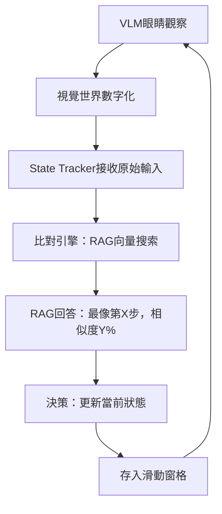
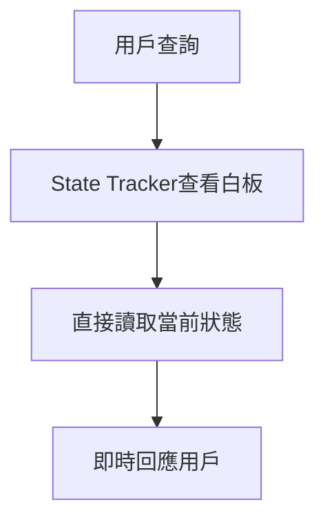

# AI Manual Assistant 記憶系統討論記錄

## 📅 最終架構確認日期
2025年7月25日

## 🎯 最終架構設計：雙循環記憶系統

### 💡 核心設計理念

**系統比喻**：
- **VLM** = 眼睛：持續觀察視覺世界，將其數字化
- **State Tracker** = 比對引擎 + 白板：智能匹配並記錄當前狀態
- **RAG** = 知識寶典：存儲結構化的任務知識

**設計哲學**：
- 潛意識狀態感知：系統在用戶無感知的情況下持續理解「我們現在進行到哪了」
- 即時響應能力：用戶查詢時毫秒級回應，無需重新計算
- 記憶體可控：通過滑動窗格確保系統資源使用恆定

### 🔄 雙循環架構設計

#### 第一循環：「潛意識」狀態感知（持續運行）


**特性**：
- 用戶無感知的背景運行
- 持續理解「我們現在進行到哪了」
- 類似人類的潛意識狀態感知
- 每2秒執行一次觀察循環

#### 第二循環：即時查詢響應（按需觸發）


**特性**：
- 毫秒級響應時間（目標 < 50ms）
- 無需重新計算或推理
- 直接從「白板」讀取完整狀態信息
- 包含步驟、任務、工具、完成標誌等完整信息

### 🧠 核心組件設計

#### 1. VLM 觀察器（系統眼睛）
```python
class VLMObserver:
    def capture_current_screen(self) -> str:
        """只負責當下觀察，不存儲歷史"""
        return "用戶正在轉動主水閥，水流逐漸減少"
```

**特性**：
- 無狀態設計：只觀察，不存儲
- 持續運行：每2秒捕獲一次
- 輸出標準化：返回文字描述

#### 2. RAG 長期記憶（知識寶典）
```yaml
# 豐富的任務知識格式
- step_id: 2
  task_description: "關閉主水閥，排空管道內的水"
  tools_needed: ["無需工具", "可能需要手套"]
  completion_indicators: ["水流完全停止", "管道內無水聲"]
  visual_cues: ["水閥", "關閉", "水流", "停止"]
  embedding: [0.1, 0.2, 0.3, ...]  # 預計算向量
```

**特性**：
- 結構化知識存儲
- 預計算語義向量
- 高速向量搜索（< 10ms）
- 完整的任務指導信息

#### 3. State Tracker 短期記憶（比對引擎 + 白板）
```python
class EnhancedStateTracker:
    def __init__(self):
        # 當前完整狀態（白板內容）
        self.current_step: Optional[int] = None
        self.current_task_description: str = ""
        self.current_tools_needed: List[str] = []
        self.current_completion_indicators: List[str] = []
        
        # 滑動窗格（記憶體管控）
        self.sliding_window = SlidingWindow(max_size=5)
```

**核心功能**：
- **比對引擎**：將VLM觀察與RAG知識進行語義匹配
- **白板機制**：存儲當前完整狀態，支持即時查詢
- **滑動窗格**：管控記憶體使用，只保留最近5條狀態記錄

#### 4. 滑動窗格（記憶體管控器）
```python
class SlidingWindow:
    def add(self, state_record: Dict):
        """添加新狀態記錄，自動清理舊記錄"""
        self.state_records.append(state_record)
        if len(self.state_records) > self.max_size:
            removed = self.state_records.pop(0)  # 移除最舊記錄
```

**優化效果**：
- 記憶體使用恆定（< 1MB）
- 存儲結構化結果而非原始VLM文本
- 節省80%+記憶體空間

### 📊 關鍵設計決策

#### 1. 數據流優化：先比對RAG，再存入滑動窗格
```python
def process_vlm_observation(self, vlm_text: str):
    # 1. 先與RAG比對（獲得結構化結果）
    match_result = rag.find_matching_step(vlm_text)
    
    # 2. 存入結構化結果到滑動窗格
    self.sliding_window.add({
        "step": match_result.step_id,
        "task": match_result.task_description,
        "tools": match_result.tools_needed,
        "confidence": match_result.similarity
    })
    
    # 3. 更新當前狀態（白板）
    if match_result.similarity > 0.35:
        self.current_step = match_result.step_id
        self.current_task_description = match_result.task_description
```

**優勢**：
- 用戶查詢時無需再次查RAG
- 滑動窗格存儲高效的結構化數據
- 記憶體使用最優化

#### 2. 完整狀態信息存儲
State Tracker不僅記錄「在第幾步」，還記錄：
- 該步驟要做什麼事情
- 需要什麼工具
- 怎樣算完成
- 安全注意事項

#### 3. VLM不穩定性的容錯設計
- **多層相似度閾值**：高(0.7)/中(0.5)/低(0.35)信心度分級處理
- **保守狀態更新**：低信心度時保持當前狀態，避免錯誤跳躍
- **連續失敗檢測**：超過10次連續失敗時進入維持狀態模式
- **VLM輸出清理**：處理亂碼、空輸出、異常格式
- **跳過機制**：VLM失敗時不中斷潛意識循環
- **滑動窗格歷史分析**：基於歷史模式進行狀態推斷
- **自適應閾值調整**：根據VLM品質動態調整匹配閾值

### 🎯 系統性能指標

#### 響應性能
- **用戶查詢響應**：< 50ms（目標20ms）
- **狀態更新延遲**：< 100ms（目標50ms）
- **RAG向量搜索**：< 10ms（目標5ms）
- **VLM觀察處理**：< 200ms（目標100ms）

#### 準確性指標
- **狀態匹配準確率**：> 85%（目標90%）
- **用戶查詢滿意度**：> 90%（目標95%）
- **系統穩定運行**：> 24小時（目標72小時）

#### 資源使用
- **總記憶體使用**：< 50MB（目標30MB）
- **滑動窗格記憶體**：< 1MB
- **CPU使用率**：< 20%（目標10%）

### 🚀 論文Demo展示價值

#### 學術創新點
1. **雙循環架構**：潛意識感知 + 即時響應的創新設計
2. **智能狀態匹配**：基於語義向量的自動任務進度識別
3. **記憶體管控**：滑動窗格的工程化記憶體管理
4. **即時響應機制**：白板式狀態存儲的高效查詢

#### 工程實用性
1. **性能優化**：毫秒級響應，適合實時應用
2. **資源控制**：固定記憶體使用，適合移動設備
3. **容錯設計**：多重機制應對VLM不穩定性
4. **可擴展性**：模組化設計，易於擴展新任務

#### Demo場景設計
- **任務**：「煮一杯咖啡」完整流程演示
- **測試驗證**：Demo前使用5-10張靜態圖片進行系統準確性測試
- **展示重點**：
  - 潛意識循環的持續狀態感知
  - 即時響應循環的快速查詢
  - 滑動窗格的記憶體管控效果
  - 完整任務指導的實用性
  - 靜態圖片測試的準確性驗證

### 📋 實施策略

#### 開發優先級
1. **高優先級**：RAG知識庫 + State Tracker核心 + 雙循環整合
2. **中優先級**：滑動窗格 + 性能監控 + Demo界面
3. **低優先級**：深度優化 + 錯誤處理完善 + Demo材料

#### 驗收標準
- 雙循環穩定運行 > 1小時
- 狀態匹配準確率 > 85%
- 用戶查詢響應 < 50ms
- 記憶體使用 < 50MB
- Demo場景完整運行

### 📝 重要決策記錄

1. **架構決策**：採用雙循環設計，而非單一循環
2. **記憶體決策**：滑動窗格存儲結構化結果，不存原始VLM文本
3. **性能決策**：先比對RAG再存儲，避免用戶查詢時重複計算
4. **容錯決策**：多層容錯機制，但保持系統簡潔性
5. **Demo決策**：專注核心創新展示，避免過度複雜化

---

**文檔版本**：v2.0（雙循環架構）  
**最後更新**：2025年7月25日  
**狀態**：架構確認完成，準備實施  
**目標**：論文Demo展示系統核心創新和工程實用性