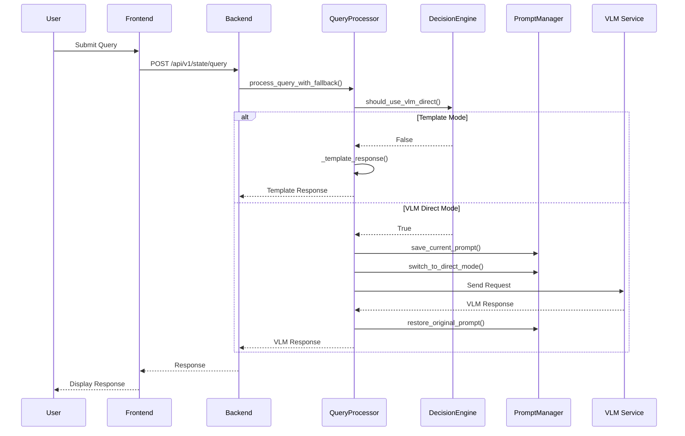

# VLM Fallback System - 系統設計文檔

## 1. 系統架構

### 1.1 整體架構

```
┌─────────────────┐    ┌─────────────────┐    ┌─────────────────┐
│   Frontend      │    │   Backend API   │    │   VLM Service   │
│                 │    │                 │    │                 │
│ - Query Input   │───▶│ - Query Router  │───▶│ - Model Server  │
│ - Image Upload  │    │ - State Tracker │    │ - Prompt Mgmt   │
│ - Response UI   │◀───│ - VLM Fallback  │◀───│ - Response Gen  │
└─────────────────┘    └─────────────────┘    └─────────────────┘
                              │
                              ▼
                       ┌─────────────────┐
                       │   Logging       │
                       │   System        │
                       │                 │
                       │ - Query Logs    │
                       │ - VLM Logs      │
                       │ - Error Logs    │
                       └─────────────────┘
```

### 1.2 核心組件

#### 1.2.1 QueryProcessor (增強版)
```python
class EnhancedQueryProcessor:
    def __init__(self):
        self.vlm_client = VLMClient()
        self.prompt_manager = PromptManager()
        self.decision_engine = DecisionEngine()
    
    async def process_query_with_fallback(self, query, state_data, image_data=None):
        # 決策邏輯
        if self.decision_engine.should_use_vlm_direct(query, state_data):
            return await self._vlm_direct_response(query, image_data)
        else:
            return self._template_response(query, state_data)
```

#### 1.2.2 DecisionEngine
```python
class DecisionEngine:
    def __init__(self):
        self.confidence_threshold = 0.40
        self.unknown_query_patterns = [...]
    
    def should_use_vlm_direct(self, query: str, state_data: Optional[Dict]) -> bool:
        # 實現決策邏輯
        pass
```

#### 1.2.3 PromptManager
```python
class PromptManager:
    def __init__(self):
        self.original_prompt = None
        self.direct_answer_prompt_template = "..."
    
    def save_current_prompt(self):
        # 保存當前提示詞
        pass
    
    def switch_to_direct_mode(self, query: str):
        # 切換到直接回答模式
        pass
    
    def restore_original_prompt(self):
        # 恢復原始提示詞
        pass
```

## 2. 詳細設計

### 2.1 查詢處理流程



### 2.2 決策引擎設計

#### 2.2.1 決策矩陣
| 條件 | 權重 | 閾值 | 動作 |
|------|------|------|------|
| 無狀態數據 | 1.0 | N/A | 使用 VLM |
| 置信度過低 | 0.8 | < 0.40 | 使用 VLM |
| 查詢類型未知 | 0.6 | UNKNOWN | 使用 VLM |
| 查詢長度異常 | 0.4 | > 200 chars | 使用 VLM |

#### 2.2.2 決策算法
```python
def calculate_decision_score(self, query: str, state_data: Optional[Dict]) -> float:
    score = 0.0
    
    # 條件 1：無狀態數據
    if not state_data:
        score += 1.0
    
    # 條件 2：置信度過低
    if state_data and state_data.get('confidence', 0.0) < self.confidence_threshold:
        score += 0.8
    
    # 條件 3：查詢類型未知
    if self._classify_query(query) == QueryType.UNKNOWN:
        score += 0.6
    
    # 條件 4：查詢長度異常
    if len(query) > 200:
        score += 0.4
    
    return score

def should_use_vlm_direct(self, query: str, state_data: Optional[Dict]) -> bool:
    score = self.calculate_decision_score(query, state_data)
    return score >= 0.5  # 決策閾值
```

### 2.3 提示詞管理設計

#### 2.3.1 提示詞狀態機
```python
class PromptState:
    TRACKING = "tracking"
    DIRECT = "direct"
    ERROR = "error"

class PromptManager:
    def __init__(self):
        self.current_state = PromptState.TRACKING
        self.original_prompt = None
        self.prompt_stack = []
    
    def switch_to_direct(self, query: str) -> bool:
        try:
            # 保存當前狀態
            self.prompt_stack.append(self.current_state)
            self.original_prompt = self._get_current_prompt()
            
            # 切換到直接模式
            self.current_state = PromptState.DIRECT
            self._set_direct_prompt(query)
            return True
        except Exception as e:
            self.current_state = PromptState.ERROR
            return False
    
    def restore_tracking(self) -> bool:
        try:
            if self.original_prompt:
                self._set_prompt(self.original_prompt)
                self.current_state = PromptState.TRACKING
                self.original_prompt = None
                return True
            return False
        except Exception as e:
            self.current_state = PromptState.ERROR
            return False
```

#### 2.3.2 提示詞模板
```python
# 狀態追蹤提示詞（現有）
STATE_TRACKING_PROMPT = """
You are an AI Manual Assistant with state tracking capabilities...
[現有的完整提示詞]
"""

# 直接回答提示詞（新增）
DIRECT_ANSWER_PROMPT = """
You are a helpful AI assistant. The user is asking: "{query}"

Please provide a direct, helpful answer to their question. Focus on being:
- Accurate and informative
- Helpful and supportive  
- Clear and concise
- Relevant to their specific question

If the question is related to:
- General knowledge: Provide accurate information
- Personal assistance: Be helpful and supportive
- Technical questions: Give clear explanations
- Creative requests: Be imaginative and engaging

Keep your response focused and relevant to what they're asking.
"""
```

### 2.4 錯誤處理設計

#### 2.4.1 錯誤分類
```python
class VLMFallbackError(Exception):
    """VLM Fallback 系統錯誤基類"""
    pass

class PromptSwitchError(VLMFallbackError):
    """提示詞切換錯誤"""
    pass

class VLMServiceError(VLMFallbackError):
    """VLM 服務錯誤"""
    pass

class StateRecoveryError(VLMFallbackError):
    """狀態恢復錯誤"""
    pass
```

#### 2.4.2 錯誤處理策略
```python
class ErrorHandler:
    def __init__(self):
        self.fallback_responses = {
            "prompt_switch": "I'm having trouble processing your request. Please try again.",
            "vlm_service": "The AI service is temporarily unavailable. Please try again later.",
            "state_recovery": "There was an issue with the system state. Please refresh and try again."
        }
    
    def handle_error(self, error: Exception, context: Dict) -> str:
        if isinstance(error, PromptSwitchError):
            return self.fallback_responses["prompt_switch"]
        elif isinstance(error, VLMServiceError):
            return self.fallback_responses["vlm_service"]
        elif isinstance(error, StateRecoveryError):
            return self.fallback_responses["state_recovery"]
        else:
            return "An unexpected error occurred. Please try again."
```

## 3. 數據模型

### 3.1 查詢請求模型
```python
@dataclass
class QueryRequest:
    query: str
    query_id: Optional[str] = None
    image_data: Optional[str] = None
    user_id: Optional[str] = None
    timestamp: Optional[datetime] = None
```

### 3.2 查詢響應模型
```python
@dataclass
class QueryResponse:
    query: str
    response: str
    query_type: str
    response_mode: str  # "template" 或 "vlm_direct"
    confidence: float
    processing_time_ms: float
    error: Optional[str] = None
```

### 3.3 決策記錄模型
```python
@dataclass
class DecisionRecord:
    query_id: str
    decision_score: float
    decision_reason: str
    response_mode: str
    timestamp: datetime
    state_data: Optional[Dict] = None
```

## 4. 配置管理

### 4.1 配置文件結構
```yaml
vlm_fallback:
  decision_engine:
    confidence_threshold: 0.40
    decision_threshold: 0.5
    max_query_length: 200
    
  prompts:
    direct_answer_template: |
      You are a helpful AI assistant...
    
  performance:
    vlm_timeout: 30
    max_retries: 3
    
  logging:
    enable_decision_logs: true
    enable_prompt_logs: true
```

### 4.2 動態配置
```python
class VLMFallbackConfig:
    def __init__(self):
        self.confidence_threshold = 0.40
        self.decision_threshold = 0.5
        self.vlm_timeout = 30
        self.max_retries = 3
    
    def update_from_dict(self, config_dict: Dict):
        # 動態更新配置
        pass
```

## 5. 性能考慮

### 5.1 緩存策略
- **提示詞緩存**：緩存常用的提示詞模板
- **決策結果緩存**：緩存相似查詢的決策結果
- **VLM 響應緩存**：緩存常見問題的 VLM 響應

### 5.2 並發處理
- **線程安全**：確保提示詞管理的線程安全
- **連接池**：VLM 客戶端連接池
- **請求隊列**：處理高並發請求

### 5.3 監控指標
- **決策準確率**：VLM 模式 vs 模板模式的準確率
- **響應時間**：各模式的平均響應時間
- **錯誤率**：各類錯誤的發生率
- **資源使用**：CPU、內存、網路使用情況

## 6. 安全考慮

### 6.1 輸入驗證
- **查詢長度限制**：防止過長的查詢
- **內容過濾**：過濾惡意內容
- **頻率限制**：防止濫用

### 6.2 數據保護
- **敏感信息過濾**：不在日誌中記錄敏感信息
- **訪問控制**：限制對 VLM 服務的訪問
- **審計日誌**：記錄所有操作

## 7. 部署考慮

### 7.1 環境配置
- **開發環境**：使用模擬 VLM 服務
- **測試環境**：使用測試 VLM 服務
- **生產環境**：使用生產 VLM 服務

### 7.2 監控和警報
- **健康檢查**：定期檢查系統健康狀態
- **性能警報**：響應時間超標警報
- **錯誤警報**：錯誤率超標警報 