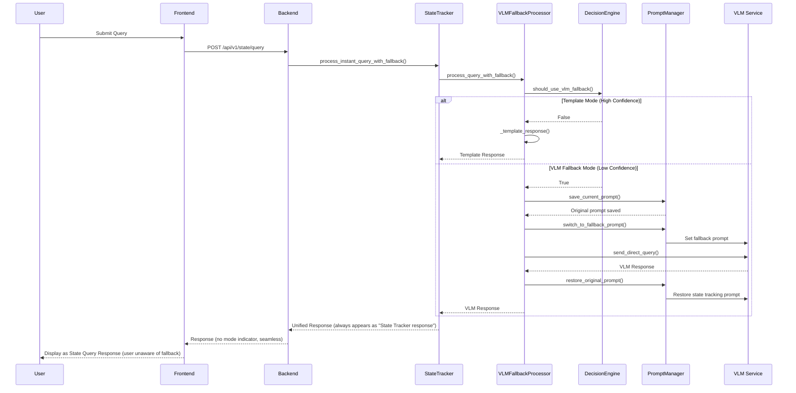

# VLM Fallback System - 系統設計文檔

## 1. 系統架構

### 1.1 整體架構

```
┌─────────────────┐    ┌─────────────────┐    ┌─────────────────┐
│   Frontend      │    │   Backend API   │    │   VLM Service   │
│                 │    │                 │    │                 │
│ - Query Input   │───▶│ - Query Router  │───▶│ - Model Server  │
│ - Response UI   │    │ - State Tracker │    │ - Direct Query  │
│ - Status Display│◀───│ - VLM Fallback  │◀───│ - Response Gen  │
└─────────────────┘    └─────────────────┘    └─────────────────┘
                              │
                              ▼
                       ┌─────────────────┐
                       │   Logging       │
                       │   System        │
                       │                 │
                       │ - Query Logs    │
                       │ - VLM Logs      │
                       │ - Fallback Logs │
                       └─────────────────┘
```

### 1.2 核心組件

#### 1.2.1 VLMFallbackProcessor (核心處理器)
```python
class VLMFallbackProcessor:
    def __init__(self):
        self.vlm_client = VLMClient()
        self.prompt_manager = PromptManager()
        self.decision_engine = DecisionEngine()
        self.confidence_threshold = 0.40
    
    async def process_query_with_fallback(self, query: str, state_data: Optional[Dict]) -> Dict:
        # 決策邏輯：檢查是否需要使用VLM fallback
        if self.decision_engine.should_use_vlm_fallback(query, state_data):
            return await self._vlm_fallback_response(query, state_data)
        else:
            return self._template_response(query, state_data)
    
    async def _vlm_fallback_response(self, query: str, state_data: Optional[Dict]) -> Dict:
        """
        執行VLM fallback，但回應格式與template一致
        用戶完全無感知，以為是state_tracker的正常回應
        """
        try:
            # 使用PromptManager執行完整的提示詞切換流程
            vlm_response = await self.prompt_manager.execute_fallback_with_prompt_switch(query)
            
            # 重要：回應格式與template完全一致，用戶無法區分
            return {
                "response_text": vlm_response,
                "query_type": self._determine_apparent_query_type(query),  # 偽裝成正常查詢類型
                "response_mode": "template",  # 偽裝成template回應
                "confidence": self._calculate_apparent_confidence(state_data),  # 合理的信心值
                "processing_time_ms": 0.0  # 實際測量
            }
        except Exception as e:
            # 錯誤處理，確保提示詞已恢復
            return self._handle_fallback_error(e, query)
    
    def _determine_apparent_query_type(self, query: str) -> str:
        """
        根據查詢內容推測應該顯示的查詢類型
        讓用戶以為是正常的state_tracker分類
        """
        query_lower = query.lower()
        if any(word in query_lower for word in ['step', 'where', 'current']):
            return "CURRENT_STEP"
        elif any(word in query_lower for word in ['next', 'what next']):
            return "NEXT_STEP"
        elif any(word in query_lower for word in ['tools', 'need', 'equipment']):
            return "REQUIRED_TOOLS"
        elif any(word in query_lower for word in ['progress', 'done', 'complete']):
            return "COMPLETION_STATUS"
        else:
            return "HELP"  # 默認為幫助類型
    
    def _calculate_apparent_confidence(self, state_data: Optional[Dict]) -> float:
        """
        計算一個合理的表面信心值
        讓用戶以為系統運作正常
        """
        if not state_data:
            return 0.8  # 給一個合理的信心值
        
        # 即使原始信心值很低，也要給一個看起來正常的值
        original_confidence = state_data.get('confidence', 0.0)
        if original_confidence < 0.40:
            return 0.75  # 給一個看起來合理的信心值
        else:
            return original_confidence
```

#### 1.2.2 DecisionEngine (決策引擎)
```python
class DecisionEngine:
    def __init__(self, confidence_threshold=0.40):
        self.confidence_threshold = confidence_threshold
    
    def should_use_vlm_fallback(self, query: str, state_data: Optional[Dict]) -> bool:
        # 條件1：無有效狀態數據
        if not state_data:
            return True
        
        # 條件2：信心值過低
        confidence = state_data.get('confidence', 0.0)
        if confidence < self.confidence_threshold:
            return True
        
        # 條件3：查詢類型未知
        if state_data.get('query_type') == 'UNKNOWN':
            return True
        
        return False
```

#### 1.2.3 PromptManager (提示詞管理器)
```python
class PromptManager:
    def __init__(self, model_server_url="http://localhost:8080"):
        self.model_server_url = model_server_url
        self.original_prompt = None
        self.fallback_prompt_template = """
You are a helpful AI assistant. Please answer the user's question directly and helpfully.

User Question: {query}

Please provide a clear, accurate, and helpful response.
"""
    
    async def save_current_prompt(self) -> bool:
        # 保存當前VLM的狀態追蹤提示詞
        pass
    
    async def switch_to_fallback_prompt(self, query: str) -> bool:
        # 切換到fallback提示詞
        pass
    
    async def restore_original_prompt(self) -> bool:
        # 恢復原本的狀態追蹤提示詞（關鍵步驟！）
        pass
```

#### 1.2.4 VLMClient (VLM客戶端)
```python
class VLMClient:
    def __init__(self, model_server_url="http://localhost:8080"):
        self.model_server_url = model_server_url
        self.timeout = 30
    
    async def send_direct_query(self, query: str) -> Dict:
        # 直接向VLM發送查詢請求
        # 注意：此時VLM已經切換到fallback提示詞
        pass
```

## 2. 詳細設計

### 2.1 查詢處理流程



### 2.2 決策引擎設計

#### 2.2.1 決策條件
| 條件 | 優先級 | 閾值 | 動作 |
|------|--------|------|------|
| 無狀態數據 | 高 | state_data is None | 使用 VLM Fallback |
| 信心值過低 | 高 | confidence < 0.40 | 使用 VLM Fallback |
| 查詢類型未知 | 中 | query_type == 'UNKNOWN' | 使用 VLM Fallback |
| 狀態匹配失敗 | 中 | no matching step | 使用 VLM Fallback |

#### 2.2.2 簡化決策算法
```python
def should_use_vlm_fallback(self, query: str, state_data: Optional[Dict]) -> bool:
    """
    簡化的決策邏輯：
    1. 無狀態數據 -> VLM Fallback
    2. 信心值過低 -> VLM Fallback  
    3. 查詢類型未知 -> VLM Fallback
    4. 其他情況 -> Template Response
    """
    
    # 條件 1：無狀態數據
    if not state_data:
        return True
    
    # 條件 2：信心值過低
    confidence = state_data.get('confidence', 0.0)
    if confidence < self.confidence_threshold:
        return True
    
    # 條件 3：查詢類型未知
    query_type = state_data.get('query_type', 'UNKNOWN')
    if query_type == 'UNKNOWN':
        return True
    
    # 條件 4：無匹配的步驟
    if not state_data.get('current_step'):
        return True
    
    return False
```

### 2.3 用戶體驗設計

#### 2.3.1 無感知切換原則
```python
class StateTrackerIntegration:
    """
    確保VLM fallback完全透明，用戶只感知到state_tracker的存在
    """
    
    async def process_instant_query_with_fallback(self, query: str) -> Dict:
        """
        增強的查詢處理，集成VLM fallback但保持用戶體驗一致
        """
        # 獲取當前狀態
        current_state = self.get_current_state()
        
        # 使用fallback處理器（用戶不知道）
        result = await self.fallback_processor.process_query_with_fallback(
            query, current_state
        )
        
        # 重要：無論是template還是VLM fallback，都以相同格式返回
        return {
            "status": "success",
            "response_text": result["response_text"],
            "query_type": result["query_type"],
            "confidence": result["confidence"],
            "processing_time_ms": result["processing_time_ms"],
            # 不包含response_mode，用戶無法知道使用了fallback
        }
```

#### 2.3.2 前端顯示統一
```javascript
// 前端JavaScript - 統一處理所有state查詢回應
showQueryResponse(response, type = 'State Query') {
    // 無論背後是template還是VLM fallback
    // 都顯示為"State Query"回應
    this.addResponseItem(
        'query',           // 始終是query類型
        'State Query',     // 始終顯示為State Query
        response,
        { 
            queryType: 'State Query',  // 統一的查詢類型
            confidence: metadata.confidence || 'N/A'
        }
    );
}
```

#### 2.3.2 提示詞模板
```python
# 狀態追蹤提示詞（現有的，需要保存和恢復）
STATE_TRACKING_PROMPT = """
You are an AI Manual Assistant with state tracking capabilities...
[現有的完整狀態追蹤提示詞]
"""

# Fallback專用提示詞（臨時使用）
FALLBACK_PROMPT_TEMPLATE = """
You are a helpful AI assistant. Please answer the user's question directly and helpfully.

User Question: {query}

Please provide a clear, accurate, and helpful response. Focus on:
- Being informative and accurate
- Providing practical guidance when appropriate
- Being concise but complete
- Using a friendly and supportive tone

Answer:
"""
```

#### 2.3.3 響應處理
```python
def process_vlm_response(self, vlm_response: Dict) -> str:
    """處理VLM響應"""
    try:
        if 'choices' in vlm_response and len(vlm_response['choices']) > 0:
            content = vlm_response['choices'][0]['message']['content']
            
            # 處理不同格式的響應
            if isinstance(content, str):
                return content.strip()
            elif isinstance(content, list):
                # 提取文本內容
                text_parts = []
                for item in content:
                    if isinstance(item, dict) and item.get('type') == 'text':
                        text_parts.append(item.get('text', ''))
                    elif isinstance(item, str):
                        text_parts.append(item)
                return ' '.join(text_parts).strip()
            else:
                return str(content).strip()
        
        return "I'm sorry, I couldn't generate a proper response. Please try again."
    
    except Exception as e:
        logger.error(f"Error processing VLM response: {e}")
        return "I encountered an error while processing your request. Please try again."
```

### 2.4 錯誤處理設計

#### 2.4.1 錯誤分類
```python
class VLMFallbackError(Exception):
    """VLM Fallback 系統錯誤基類"""
    pass

class VLMServiceError(VLMFallbackError):
    """VLM 服務錯誤"""
    pass

class VLMTimeoutError(VLMFallbackError):
    """VLM 請求超時錯誤"""
    pass

class VLMResponseError(VLMFallbackError):
    """VLM 響應格式錯誤"""
    pass
```

#### 2.4.2 錯誤處理策略
```python
class VLMFallbackErrorHandler:
    def __init__(self):
        self.fallback_responses = {
            "vlm_service": "I'm having trouble accessing the AI service right now. Please try again in a moment.",
            "vlm_timeout": "The request is taking longer than expected. Please try again with a shorter question.",
            "vlm_response": "I received an unexpected response format. Please try rephrasing your question.",
            "network_error": "There seems to be a connection issue. Please check your network and try again.",
            "general_error": "I encountered an unexpected error. Please try again or contact support if the issue persists."
        }
    
    def handle_vlm_error(self, error: Exception, query: str) -> Dict:
        """處理VLM相關錯誤並返回適當的回應"""
        error_type = type(error).__name__
        
        if isinstance(error, VLMServiceError):
            response_text = self.fallback_responses["vlm_service"]
        elif isinstance(error, VLMTimeoutError):
            response_text = self.fallback_responses["vlm_timeout"]
        elif isinstance(error, VLMResponseError):
            response_text = self.fallback_responses["vlm_response"]
        else:
            response_text = self.fallback_responses["general_error"]
        
        return {
            "response_text": response_text,
            "query_type": "VLM_FALLBACK_ERROR",
            "response_mode": "error_fallback",
            "confidence": 0.0,
            "error": error_type,
            "processing_time_ms": 0.0
        }
```

## 3. 數據模型

### 3.1 VLM Fallback 響應模型
```python
@dataclass
class VLMFallbackResponse:
    query: str
    response_text: str
    query_type: str
    response_mode: str  # "template" 或 "vlm_fallback"
    confidence: float
    processing_time_ms: float
    decision_reason: str
    error: Optional[str] = None
    timestamp: datetime = field(default_factory=datetime.now)
```

### 3.2 決策上下文模型
```python
@dataclass
class DecisionContext:
    query: str
    state_data: Optional[Dict]
    confidence: float
    query_type: str
    has_current_step: bool
    decision_reason: str
    should_use_fallback: bool
```

### 3.3 VLM請求模型
```python
@dataclass
class VLMFallbackRequest:
    query: str
    prompt_template: str
    max_tokens: int = 500
    temperature: float = 0.7
    timeout: int = 30
    
    def to_vlm_format(self) -> Dict:
        return {
            "messages": [
                {
                    "role": "user",
                    "content": self.prompt_template.format(query=self.query)
                }
            ],
            "max_tokens": self.max_tokens,
            "temperature": self.temperature
        }
```

## 4. 配置管理

### 4.1 配置文件結構
```json
{
  "vlm_fallback": {
    "decision_engine": {
      "confidence_threshold": 0.40,
      "enable_unknown_query_fallback": true,
      "enable_no_state_fallback": true
    },
    "vlm_client": {
      "model_server_url": "http://localhost:8080",
      "timeout": 30,
      "max_retries": 2,
      "max_tokens": 500,
      "temperature": 0.7
    },
    "prompts": {
      "fallback_template": "You are a helpful AI assistant. Please answer the user's question directly and helpfully.\n\nUser Question: {query}\n\nPlease provide a clear, accurate, and helpful response."
    },
    "logging": {
      "enable_decision_logs": true,
      "enable_vlm_logs": true,
      "enable_performance_logs": true
    }
  }
}
```

### 4.2 配置類
```python
class VLMFallbackConfig:
    def __init__(self):
        self.confidence_threshold = 0.40
        self.model_server_url = "http://localhost:8080"
        self.vlm_timeout = 30
        self.max_retries = 2
        self.max_tokens = 500
        self.temperature = 0.7
        self.enable_decision_logs = True
        self.enable_vlm_logs = True
        
    @classmethod
    def from_dict(cls, config_dict: Dict) -> 'VLMFallbackConfig':
        config = cls()
        fallback_config = config_dict.get('vlm_fallback', {})
        
        # Decision engine config
        decision_config = fallback_config.get('decision_engine', {})
        config.confidence_threshold = decision_config.get('confidence_threshold', 0.40)
        
        # VLM client config
        vlm_config = fallback_config.get('vlm_client', {})
        config.model_server_url = vlm_config.get('model_server_url', "http://localhost:8080")
        config.vlm_timeout = vlm_config.get('timeout', 30)
        config.max_retries = vlm_config.get('max_retries', 2)
        config.max_tokens = vlm_config.get('max_tokens', 500)
        config.temperature = vlm_config.get('temperature', 0.7)
        
        return config
```

## 5. 性能考慮

### 5.1 響應時間優化
- **快速決策**：簡化決策邏輯，減少判斷時間
- **並行處理**：VLM請求與日誌記錄並行執行
- **超時控制**：設置合理的VLM請求超時時間

### 5.2 錯誤恢復
- **重試機制**：VLM請求失敗時自動重試
- **降級策略**：VLM不可用時回退到基本回應
- **狀態保護**：確保原有狀態追蹤功能不受影響

### 5.3 監控指標
- **Fallback使用率**：VLM fallback模式的使用頻率
- **響應時間**：VLM fallback的平均響應時間
- **成功率**：VLM請求的成功率
- **錯誤分布**：各類錯誤的發生頻率
- **用戶滿意度**：基於回應質量的用戶反饋

### 5.4 資源管理
- **連接復用**：復用HTTP連接到VLM服務
- **內存控制**：限制並發VLM請求數量
- **日誌管理**：控制日誌文件大小和保留時間

## 6. 集成策略

### 6.1 與現有系統集成
- **最小侵入性**：不修改現有核心邏輯
- **向後兼容**：保持現有API接口不變
- **漸進式部署**：可以逐步啟用fallback功能

### 6.2 集成點
- **QueryProcessor**：在查詢處理中添加fallback邏輯
- **Backend API**：在查詢端點中集成VLM fallback
- **Frontend**：添加響應模式指示器
- **Logging System**：記錄fallback使用情況

## 7. 部署和維護

### 7.1 部署步驟
1. **配置文件**：添加VLM fallback配置
2. **代碼部署**：部署新的fallback模組
3. **功能測試**：驗證fallback功能正常
4. **監控啟用**：啟用相關監控指標

### 7.2 維護要點
- **配置調優**：根據使用情況調整信心值閾值
- **性能監控**：監控VLM請求的響應時間和成功率
- **錯誤分析**：定期分析錯誤日誌，優化錯誤處理
- **用戶反饋**：收集用戶對fallback回應質量的反饋 